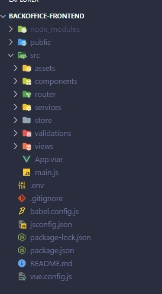

# Individueel Project Semester 3

## Project: Warehouse Management System (WMS)

### Projectbeschrijving
In dit semester ben ik voor mijn individuele project begonnen aan een order/warehouse management tool. Met behulp van deze webapplicatie kunnen medewerkers alle processen binnen het warehouse beheren en overzichtelijk inzien.
Het is bijvoorbeeld mogelijk om producten, leveranciers en bestellingen te beheren en deze te koppelen aan voorraadlocaties zodat altijd duidelijk is waar welk product ligt opgeslagen. 
Ook is er de mogelijkheid om bestellingen te verwerken die binnenkomen via verschillende verkoopplatformen en/of webshops.

Het idee voor dit project is ontstaan vanuit mijn eigen bedrijf. Ik ben actief als verkoper op bol.com en heb dagelijks te maken met logstieke processen. Op dit moment gebruiken we daarvoor externe software, deze software werkt prima, alleen missen we soms wat functionaliteiten. Met behulp van dit project proberen we deze functionaliteiten zelf te ontwikkelen.

### Requirements
Klanten
  -	Een medewerker kan een nieuwe klant toevoegen in het systeem
  -	Een medewerker kan een bestaande klant aanpassen in het systeem.
  -	Een medewerker kan een bestaande klant verwijderen uit het systeem.
  -	Er kan een export gemaakt worden van alle klanten uit het systeem.

Producten
  -	Een medewerker kan een nieuw product toevoegen in het systeem. 
  -	Een medewerker kan een bestaand product aanpassen in het systeem
  -	Een medewerker kan een bestaand product op in-actief zetten in het systeem.
  - Een medewerker kan een bestaand product verwijderen uit het systeem. 
  -	Een medewerker kan een bestaand product koppelen aan een voorraadlocatie. 
  -	Een medewerker kan een bestaand product koppelen aan een leverancier
  -	Er kan een export gemaakt worden van alle producten uit het systeem.

Leveranciers
  -	Een medewerker kan een nieuwe leverancier toevoegen aan het systeem
  -	Een medewerker kan een bestaande leverancier aanpassen in het systeem.
  -	Een medewerker kan een bestaande leverancier verwijderen uit het systeem.
  -	Er kan een export gemaakt worden van alle leveranciers.
 
Bestellingen
  -	Een medewerker kan een nieuwe bestelling toevoegen in het systeem.
  -	Een medewerker kan een bestaande bestelling aanpassen in het systeem.
  -	Een medewerker kan een bestaande bestelling annuleren in het systeem.
  -	Een medewerker kan een bestelling verwerken in het systeem.
  -	Een medewerker kan een verzendlabel aanvragen bij de vervoerder.
  -	Er kan een export gemaakt worden van alle bestellingen.

Voorraadlocaties
  -	Een medewerker kan een nieuwe voorraadlocatie aanmaken in het systeem
  -	Een medewerker kan een bestaande voorraadlocatie aanpassen in het systeem.
  -	Een medewerker kan een bestaande voorraadlocatie verwijderen uit het systeem
  -	Er kan een export gemaakt worden van alle voorraadlocaties.

### User Stories
Producten
  - Als een gebruiker wil ik nieuwe producten kunnen toevoegen aan het systeem :white_check_mark:
  - Als een gebruiker wil ik bestaande producten kunnen wijzigen in het systeem
  - Als een gebruiker wil ik een bestaande product kunnen verwijderen uit het systeem :white_check_mark:
  - Als een gebruiker wil ik alle producten uit het systeem kunnen inzien :white_check_mark:
  - Als een gebruiker wil ik een bestaand product op non-actief kunnen zetten :white_check_mark:

Klanten
  - Als een gebruiker wil ik een nieuwe klant kunnen toevoegen aan het systeem
  - Als een gebruiker wil ik een bestaande klant kunnen aanpassen in het systeem
  - Als een gebruiker wil ik een bestaande klant kunnen verwijderen uit het systeem
  - Als een gebruiker wil ik een overzicht hebben van alle klanten
  
Voorraadlocaties
  - Als een gebruiker wil ik nieuwe voorraadlocaties kunnen aanmaken in het systeem
  - Als een gebruiker wil ik bestaande voorraadlocaties kunnen aanpassen in het systeem
  - Als een gebruiker wil ik bestaande voorraadlocaties kunnen verwijderen uit het systeem
  - Als gebruiker wil ik een bestaand product kunnen koppelen aan een voorraadlocatie
  - Als een gebruiker wil ik een overzicht hebben van alle voorraadlocaties

Voorraad
  - Als een gebruiker wil ik de voorraad van een product kunnen wijzigen in het systeem

Verkoopkanalen
  - Als een gebruiker wil ik mijn producten kunnen doorsturen naar verschillende marketplaces

Leveranciers
  - Als gebruiker wil ik een leverancier kunnen koppelen aan een artikel

Dashboard
  - Als een gebruiker wil ik een dashboardpagina hebben waarop ik alle belangrijke informatie kan inzien

## Technische uitwerking Project

### Front-end
De front-end van de webapplicatie heb ik ontwikkeld in Vue.js in combinatie met Javascript. Vue.js is een erg klein framework waardoor het snel te gebruiken is. Daarnaast werkt Vue.js met zogenoemde components, hierdoor kan je gemakkelijk bepaalde functionaliteiten opsplitsen en later hergebruiken binnen het project zonder de code ervan opnieuw te hoeven schrijven. Dit zorgt ervoor dat je code onderhoudbaarder wordt en daardoor ook leesbaarder.

In de afgelopen jaren heb ik al aan meerdere projecten gewerkt die in Vue.js zijn geschreven, onder andere tijdens mijn eerdere stages. Hierdoor ken ik de basis van Vue.js erg goed en wil ik mij verder verdiepen in de geadvanceerde onderdelen binnen dit framework.

Binnen Vue.js gebruik ik ook een aantal npm packages, dit zijn uitbreidingen (Vaak van derde partijen of developers) die je kan toevoegen om extra functionaliteiten out-of-the-box the gebruiken zonder het zelf te hoeven schrijven.

Voor mijn project gebruik ik de volgende packages

  - Axios (Voor het maken van HTTP Requests naar mijn backend)
  - Vuex (Vue.js State management, voor het delen van data tussen verschillende components)
  - VueRouter (Vue.js Router Plugin, voor het navigeren tussen verschillende Views/Components)
  - Yup & Vee-validate (Voor de invoervalidatie op de front-end)
  - FontAwesome (Voor de mooie icoontjes binnen het project)

Voor de CSS gebruik ik Semantic UI als UIKit, ik vind dit persoonlijk zelf een erg mooi framework, het ziet er zakelijk uit, iets wat erg goed past binnen het project. De documentatie van Semantic UI is erg duidelijk en er bestaan zelfs Vue.js components die je direct kan gebruiken.

Ik heb in het begin ook gewerkt met TailwindCSS, deze UIKit vind ik zelf erg lastig om te gebruiken. De documentatie is duidelijk maar er zijn vaak geen bruikbare components die je gemakkelijk kan importeren in het project. bij TailwindCSS moet je deze zelf ontwikkelen en stylen. Omdat dit buiten de scope van dit project valt heb ik besloten om TailwindCSS niet te gebruiken. Hiermee ga ik in een later stadium verder.

#### Mappen structuur

Voordat ik ben begonnen met het bouwen van de frontend voor mijn applicatie heb ik eerst onderzoek gedaan naar een goede mappenstructuur. Tijdens het werken met een component gebaseerd framework komen er al snel heel veel verschillende bestanden bij kijken. 

Om het overzicht niet kwijt te raken is een goede structuur cruciaal. Afhankelijk van de grootte van het project zijn daar verschillende mogelijkheden voor, zo kun je bijvoorbeeld alles groeperen op basis van een functionaliteit (Bijvoorbeeld alles van producten in een map zetten) of je kunt alle onderdelen van een applicatie splitsen (Bijvoorbeeld componenten, logica etc). 

Voor dat laatste heb ik gekozen aangezien deze variant het beste past bij het project. Ook vind ik dit persoonlijk het overzichtelijkst.

De mappenstructuur bestaat als eerste uit een aantal hoofdmappen zoals `node_modules` en `public`.
In de map node_modules komen alle geïnstalleerde packages van de npm package manager te staan.Zoals de packages eerder genoemd hierboven. 

In de public map staat het start `index.html` bestand en een favicon. Deze bestanden zijn de start van de applicatie.

Het hart van de applicatie staat in de `src` map. Hierin heb ik een aantal submappen gemaakt waarvan verschillende onderdelen van de applicatie staan.
De submappen bevatten de volgende bestanden:

  - in de `assets` map staan alle illustraties en stylesheets, denk hierbij aan afbeeldingen, CSS Bestanden, video's etc.
  - in de `components` map staan alle losse components die ik gebruik in mijn applicatie. 
    
    Deze components heb ik verder opgesplitst in UI components, Helper components en functionaliteit components. 
    UI Components bouwen de grote onderdelen van de applicatie, zoals de NavBar, Footer etc. (`NavBar.vue`, `PaginationBox.vue`, `StatusBar.vue`)
   
    De helper components zijn components die door het gehele project gebruikt kunnen worden en dienen als ondersteuning. Een voorbeeld hiervan is bijvoorbeeld een dropdownlijst. (`CountrySelector.vue`, `ImageSelector.vue`, `VATSelector.vue`)

    Als laatste heb ik de components voor elke functionaliteit ook opgesplist. In de map `product` bevinden zich componenten die te maken hebben met alles omtrent de functionaliteit product, zoals bijvoorbeeld het aanmaken van een product (`CreateProduct.vue`) of de weergave van het Product (`Product.vue`)

  - in de `router` map staat het configuratiebestand van de npm package `VueRouter`. 
    Hierin worden de verschillende routes gedefinieerd waar de gebruiker naar toe kan navigeren in de applicatie, zoals bijvoorbeeld  `/create-product` of `/products`

  - in de `services` map staat de logica van de applicatie. Hier worden bijvoorbeeld de requests naar de backend opgebouwd met behulp van de npm package `axios`.

  - in de `store` map staat het configuratiebestand van de npm package `Vuex`. 
    Hier wordt bepaalde data opgeslagen in de state van de applicatie zodat verschillende components gegevens met elkaar kunnen uitwisselen. 
    Deze store heb ik opgesplitst in losse modules zodat elke functionaliteit zijn eigen store heeft waarin data wordt opgeslagen. Dit maakt het erg overzichtelijk.

  - in de `validations` map staat het validatieschema voor het formulier dat wordt gebruikt om een nieuw product aan te maken. 
    Met behulp van de npm package `yup` kan je erg gemakkelijk validatieregels toevoegen voor elk afzonderlijk invoerveld. Deze invoerregels worden met behulp van de npm package `vee-validate` gecontroleerd zodra de gebruiker iets invoert in het formulier.

  - in de `views` map staat de daadwerkelijke pagina die wordt geladen door de applicatie met behulp van de router. 
    Op de pagina worden de verschillende componenten die benodigd zijn ingeladen.

  Als laatste zijn er nog een aantal belangrijke bestanden die los in de hoofdmap staan. Dit zijn `index.js` en `.env`. 
  
  Het index.js bestand wordt gebruikt om alle losse bestanden te combineren tot een werkende Vue applicatie.
  ReZo worden hier bijvoorbeeld verschillende pakketen ingeladen en wordt de Vue app gekoppeld aan het `index.html` bestand die we eerder in de `public` map hebben zien staan.

  In het `.env` bestand worden gevoelige gegevens opgeslagen die je liever niet in de code hebt staan. 
  In Vue.js moet elke env variable beginnen met de prefix `VUE_APP_` gevolgd door een eigen gekozen naam. 
  
  Deze variabelen worden in de code gebruikt om de waardes van de variable uit te lezen. Als de code naar een versiebeheersysteem zoals GitHub wordt gepusht wordt dit bestand uitgesloten zodat niemand toegang kan krijgen tot deze gegevens.

### Backend
De backend voor de webapplicatie bestaat uit meerdere losse REST API's (Microservices) Het doel hiervan is dat elke REST API verantwoordelijk is voor een eigen taak. De verschillende API's kunnen intern aan elkaar gekoppeld worden indien ze gegevens moeten uitwisslen.

De REST API's worden ontwikkeld in Node.js in combinatie met TypeScript op basis van Express.js
Express.js is een framework voor Node.js dat specifiek bedoeld is voor het bouwen van REST API's. Express werkt op basis van JavaScript, net zoals de frontend in Vue.js. Dit zorgt ervoor dat zowel frontend als backend in dezelfde taal worden ontwikkeld. Daarnaast is het hier ook mogelijk om de npm package manager te gebruiken voor het installeren van diverse uitbreidingen.