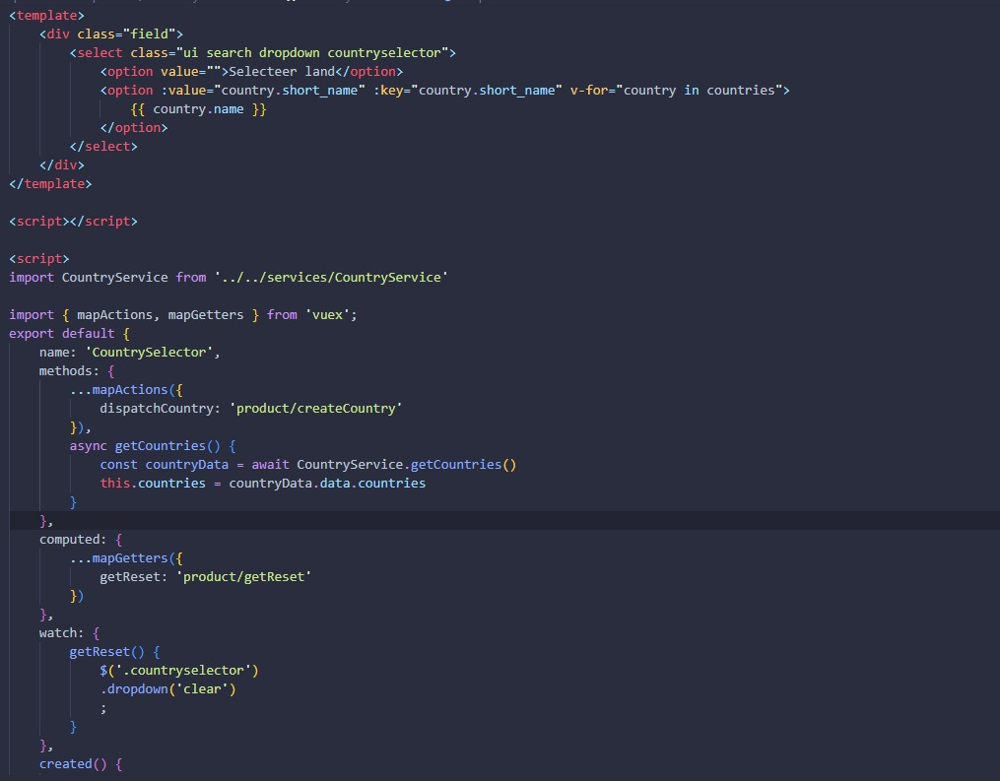
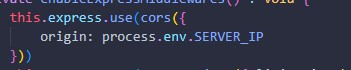
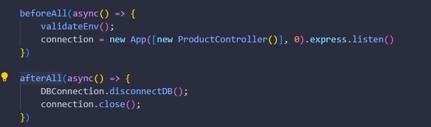

## Project: Warehouse Management System (WMS)

  

### Inleiding
In dit document vertel ik van begin tot eind wat voor project ik heb gemaakt in semester 3 en hoe ik dit technisch heb aangepakt van ontwerp tot realisatie.
Hiermee probeer ik de leeruitkomsten van dit semester aan te tonen.

Op verschillende plaatsen in dit document zijn afbeeldingen ingevoegd, deze dienen ter verduidelijking voor de geschreven tekst.

### Inhoudsopgave

-  [Inleiding](#inleiding)
-  [Projectbeschrijving](#projectbeschrijving)
-  [Requirements](#requirements)
-  [User Stories](#user-stories)
-  [Agile](#agile)
   -  [Wat is Agile?](#wat-is-agile)
   -  [Verschillende Agile werkwijzen](#verschillende-agile-werkwijzen)
   -  [Agile toegepast binnen het groepsproject](#agile-toegepast-binnen-het-groepsproject)
-  [Technische uitwerking](#technische-uitwerking)
    - [Front-end](#Front-end)
      -   [Mappenstructuur](#mappenstructuur)
      -   [Components](#components)
            - [Helper components](#helper-components)
            - [UI Components](#ui-components)
            - [Functionele Components](#functionele-components)
      -  [Router](#router)
      -  [Services](#services)
      -  [Store](#store)
      -  [Validations](#validations)
      -  [Views](#views)
      -  [Eindresultaat](#eindresultaat)
    - [Backend](#backend)
      -   [Mappenstructuur](#mappenstructuur)
      -   [Controllers](#controllers)
      -   [Interfaces](#interfaces)
      -   [Middlewares](#middlewares)
      -   [Models](#models)
      -   [Services](#services)
          -  [AWS S3](#aws-s3)
          -  [AWS Cloudfront](#aws-cloudfront)
      -   [Utils](#Utils)
          -   [Logger](#logger)
          -   [validateENV](#validateenv)
          -   [DBConnection](#dbconnection)
      -   [App & Server.ts](#server-&-app.ts)
          -   [App.ts](#app.ts)
          -   [Server.ts](#server.ts)
  - [Testen & Quality Assurance](#testen&qualityassurance)
    - [Integration Tests](#integration-tests)

### Projectbeschrijving
In dit semester ben ik voor mijn individuele project begonnen aan een order/warehouse management tool. Met behulp van deze webapplicatie kunnen medewerkers alle processen binnen het warehouse beheren en overzichtelijk inzien.
Het is bijvoorbeeld mogelijk om producten, leveranciers en bestellingen te beheren en deze te koppelen aan voorraadlocaties zodat altijd duidelijk is waar welk product ligt opgeslagen. 
Ook is er de mogelijkheid om bestellingen te verwerken die binnenkomen via verschillende verkoopplatformen en/of webshops.

Het idee voor dit project is ontstaan vanuit mijn eigen bedrijf. Ik ben actief als verkoper op bol.com en heb dagelijks te maken met logstieke processen. Op dit moment gebruiken we daarvoor externe software, deze software werkt prima, alleen missen we soms wat functionaliteiten. Met behulp van dit project proberen we deze functionaliteiten zelf te ontwikkelen.

### Requirements
Klanten
  -	Een medewerker kan een nieuwe klant toevoegen in het systeem
  -	Een medewerker kan een bestaande klant aanpassen in het systeem.
  -	Een medewerker kan een bestaande klant verwijderen uit het systeem.
  -	Er kan een export gemaakt worden van alle klanten uit het systeem.

Producten
  -	Een medewerker kan een nieuw product toevoegen in het systeem. 
  -	Een medewerker kan een bestaand product aanpassen in het systeem
  -	Een medewerker kan een bestaand product op in-actief zetten in het systeem.
  - Een medewerker kan een bestaand product verwijderen uit het systeem. 
  -	Een medewerker kan een bestaand product koppelen aan een voorraadlocatie. 
  -	Een medewerker kan een bestaand product koppelen aan een leverancier
  -	Er kan een export gemaakt worden van alle producten uit het systeem.

Leveranciers
  -	Een medewerker kan een nieuwe leverancier toevoegen aan het systeem
  -	Een medewerker kan een bestaande leverancier aanpassen in het systeem.
  -	Een medewerker kan een bestaande leverancier verwijderen uit het systeem.
  -	Er kan een export gemaakt worden van alle leveranciers.
 
Bestellingen
  -	Een medewerker kan een nieuwe bestelling toevoegen in het systeem.
  -	Een medewerker kan een bestaande bestelling aanpassen in het systeem.
  -	Een medewerker kan een bestaande bestelling annuleren in het systeem.
  -	Een medewerker kan een bestelling verwerken in het systeem.
  -	Een medewerker kan een verzendlabel aanvragen bij de vervoerder.
  -	Er kan een export gemaakt worden van alle bestellingen.

Voorraadlocaties
  -	Een medewerker kan een nieuwe voorraadlocatie aanmaken in het systeem
  -	Een medewerker kan een bestaande voorraadlocatie aanpassen in het systeem.
  -	Een medewerker kan een bestaande voorraadlocatie verwijderen uit het systeem
  -	Er kan een export gemaakt worden van alle voorraadlocaties.

### User Stories
Producten
  - Als een gebruiker wil ik nieuwe producten kunnen toevoegen aan het systeem :white_check_mark:
  - Als een gebruiker wil ik bestaande producten kunnen wijzigen in het systeem
  - Als een gebruiker wil ik een bestaande product kunnen verwijderen uit het systeem :white_check_mark:
  - Als een gebruiker wil ik alle producten uit het systeem kunnen inzien :white_check_mark:
  - Als een gebruiker wil ik een bestaand product op non-actief kunnen zetten :white_check_mark:

Klanten
  - Als een gebruiker wil ik een nieuwe klant kunnen toevoegen aan het systeem
  - Als een gebruiker wil ik een bestaande klant kunnen aanpassen in het systeem
  - Als een gebruiker wil ik een bestaande klant kunnen verwijderen uit het systeem
  - Als een gebruiker wil ik een overzicht hebben van alle klanten
  
Voorraadlocaties
  - Als een gebruiker wil ik nieuwe voorraadlocaties kunnen aanmaken in het systeem
  - Als een gebruiker wil ik bestaande voorraadlocaties kunnen aanpassen in het systeem
  - Als een gebruiker wil ik bestaande voorraadlocaties kunnen verwijderen uit het systeem
  - Als gebruiker wil ik een bestaand product kunnen koppelen aan een voorraadlocatie
  - Als een gebruiker wil ik een overzicht hebben van alle voorraadlocaties

Voorraad
  - Als een gebruiker wil ik de voorraad van een product kunnen wijzigen in het systeem

Verkoopkanalen
  - Als een gebruiker wil ik mijn producten kunnen doorsturen naar verschillende marketplaces

Leveranciers
  - Als gebruiker wil ik een leverancier kunnen koppelen aan een artikel

Dashboard
  - Als een gebruiker wil ik een dashboardpagina hebben waarop ik alle belangrijke informatie kan inzien

### Agile

#### Wat is Agile?
Agile is een methodiek die voornamelijk in de software development branch wordt gebruikt om een iteratief proces te beschrijven. Er wordt vaak gepland in verschillende sprints waarbij teams telkens een bepaald onderdeel opleveren en hier na afloop op reflecteren.

#### Verschillende Agile werkwijzen
Binnen Agile zijn er diverse werkwijzen die kunnen worden toegepast binnen een project. Elke werkwijze kan worden toegepast waar dit het meeste relevant is.
In dit voorbeeld heb ik 2 verschillende Agile werkwijzen uitgelegd:

  - SCRUM
  In SCRUM werk je samen met een projectgroep in vaak kleine periodes van enkele weken aan een set taken die onderdeel uitmaken van een (groot)project. Deze periodes worden in SCRUM termen sprints genoemd. Deze sprints zijn vooraf vastgestelde momenten waarop de projectgroep bij elkaar komt en zijn/haar voortgang van de taken presenteert aan de stakeholders.

  De stakeholders zijn vaak de belanghebbenden binnen het bedrijf waarvoor het project wordt uitgevoerd. Tijdens de sprintopleveringen kunnen zij feedback geven op de producten die worden opgeleverd door het ontwikkelteam.
  
  Als de stakeholders nog aanvullende wensen of eisen hebben dan kunnen zij deze doorgeven aan de Product owner. Hij is verantwoordelijk voor de communicatie tussen het ontwikkelteam en de stakeholders en maakt beslissingen voor het project. Ook kan de product owner de ontvangen feedback verwerken tot nieuwe taken voor de komende sprints.
  De verschillende taken worden in termen van SCRUM vaak backlog items genoemd

  - Kanban
  Deze Agile methode werkt op een totaal andere manier als SCRUM. Bij Kanban werk je met een zogenoemd bord waarbij gebruik gemaakt wordt van simpele notities. Elke notitie representeert een andere taak. Het bord wordt opgebouwd met behulp van drie kolommen genaamd:

    - To Do (Taken die nog opgepakt kunnen worden en nog niet zijn gestart)
    - Doing (Taken waar op dit moment aan wordt gewerkt)
    - Done (Taken die zijn afgerond)

  Op deze manier is er een overzichtelijk overzicht in de nog openstaande taken en kunnen knelpunten snel worden opgespoord. Afhankelijk van de grootte van het project kan het bord nog worden uitgebreid met extra kolommen zoals een review kolom. 
  In deze kolom kunnen dan taken komen te staan die bijvoorbeeld nog eerst getest moeten worden alvorens ze worden verplaatst naar afgerond.

#### Agile toegepast binnen het groepsproject
In semester 3 hebben wij ook gewerkt aan een groepsproject samen met het bedrijf iO Digital in Eindhoven.

Voor dit bedrijf zijn wij het afgelopen semester bezig geweest met het ontwikkelen van een mobiele app waarbij de gebruikers van de app eenvoudig hun collega's kunnen tracken met behulp van hun locatie in het gebouw en de ingeplande afspraken.
Het doel van de app is om de productiviteit van de collega's op kantoor te verhogen, doordat zij gemakkelijker hun collega's kunnen vinden en hierdoor geen onnodige tijd verloren gaat.

Binnen het groepsproject hebben wij gebruik gemaakt van de SCRUM methodiek die onderdeel is van Agile.
We hebben als eerste een DevOps board aangemaakt via Microsoft Azure, hierop staan alle User Stories en bijbehorende taken vermeld.

In het begin hadden we deze taken erg groot en algemeen beschreven. Gedurende het project merkte we dat het toewijzen van taken aan individuele groepsleden op deze manier erg lastig ging worden. Ook hadden we geen goed overzicht wat er nog precies moest gebeuren om een taak volledig te kunnen afronden.
Om die reden hebben we de taken later in het project opgesplitst in kleinere losse taken die onderdeel zijn van een user story. 

Na enkele weken merkte we dat door deze aanpassing er een beter overzicht is gekomen en dat de productiviteit onder de groepsleden is toegenomen.

Samen met de stakeholders hebben we besproken hoeveel sprints we voor dit project inplannen. Gezien de tijd van het semester en het aantal werkdagen in de week die zijn ingepland voor dit project zijn we uitgekomen op een totaal van 5 sprints met een interval van 3 (werk)weken, de vakantie zijn hierbij uitgesloten.
Deze sprintplanning hebben we vervolgens genoteerd in ons DevOps board.

## Technische uitwerking

### Front-end
De front-end van de webapplicatie heb ik ontwikkeld in Vue.js in combinatie met Javascript. Vue.js is een erg klein framework waardoor het snel te gebruiken is. Daarnaast werkt Vue.js met zogenoemde components, hierdoor kan je gemakkelijk bepaalde functionaliteiten opsplitsen en later hergebruiken binnen het project zonder de code ervan opnieuw te hoeven schrijven. Dit zorgt ervoor dat je code onderhoudbaarder wordt en daardoor ook leesbaarder.

In de afgelopen jaren heb ik al aan meerdere projecten gewerkt die in Vue.js zijn geschreven, onder andere tijdens mijn eerdere stages. Hierdoor ken ik de basis van Vue.js erg goed en wil ik mij verder verdiepen in de geadvanceerde onderdelen binnen dit framework.

Binnen Vue.js gebruik ik ook een aantal npm packages, dit zijn uitbreidingen (Vaak van derde partijen of developers) die je kan toevoegen om extra functionaliteiten out-of-the-box the gebruiken zonder het zelf te hoeven schrijven.

Voor mijn project gebruik ik de volgende packages

  - [Axios](https://www.npmjs.com/package/axios) (Voor het maken van HTTP Requests naar mijn backend)
  - [Vuex](https://vuex.vuejs.org/) (Vue.js State management, voor het delen van data tussen verschillende components)
  - [VueRouter](https://router.vuejs.org/) (Vue.js Router Plugin, voor het navigeren tussen verschillende Views/Components)
  - [Yup](https://www.npmjs.com/package/yup) & [Vee-validate](https://vee-validate.logaretm.com/v4/) (Voor de invoervalidatie op de front-end)
  - [FontAwesome](https://fontawesome.com/) (Voor de mooie icoontjes binnen het project)

Voor de CSS gebruik ik [Semantic UI](https://semantic-ui.com/) als UIKit, ik vind dit persoonlijk zelf een erg mooi framework, het ziet er zakelijk uit, iets wat erg goed past binnen het project. De documentatie van Semantic UI is erg duidelijk en er bestaan zelfs Vue.js components die je direct kan gebruiken.

Ik heb in het begin ook gewerkt met [Tailwind CSS](https://Tailwindcss.com), deze UIKit vind ik zelf erg lastig om te gebruiken. De documentatie is duidelijk maar er zijn vaak geen bruikbare components die je gemakkelijk kan importeren in het project. bij TailwindCSS moet je deze zelf ontwikkelen en stylen. Omdat dit buiten de scope van dit project valt heb ik besloten om TailwindCSS niet te gebruiken. Hiermee ga ik in een ander project mee verder.

#### Mappenstructuur

Voordat ik ben begonnen met het bouwen van de frontend voor mijn applicatie heb ik eerst onderzoek gedaan naar een goede mappenstructuur. Tijdens het werken met een component gebaseerd framework komen er al snel heel veel verschillende bestanden bij kijken. 

Om het overzicht niet kwijt te raken is een goede structuur cruciaal. Afhankelijk van de grootte van het project zijn daar verschillende mogelijkheden voor, zo kun je bijvoorbeeld alles groeperen op basis van een functionaliteit (Bijvoorbeeld alles van producten in een map zetten) of je kunt alle onderdelen van een applicatie splitsen (Bijvoorbeeld componenten, logica etc). 

Voor dat laatste heb ik gekozen aangezien deze variant het beste past bij het project. Ook vind ik dit persoonlijk het overzichtelijkst.

De mappenstructuur bestaat als eerste uit een aantal hoofdmappen zoals `node_modules` en `public`.
In de map node_modules komen alle geïnstalleerde packages van de npm package manager te staan. Zoals de packages eerder genoemd hierboven. 

In de public map staat het start `index.html` bestand en een favicon. Deze bestanden zijn de start van de applicatie.

Het hart van de applicatie staat in de `src` map. Hierin heb ik een aantal submappen gemaakt waarvan verschillende onderdelen van de applicatie staan.
De submappen bevatten de volgende bestanden:

  - in de `assets` map staan alle illustraties en stylesheets, denk hierbij aan afbeeldingen, CSS Bestanden, video's etc.

    

  - in de `components` map staan alle losse components die ik gebruik in mijn applicatie. 
    
    Deze components heb ik verder opgesplitst in UI components, Helper components en functionele components. 
    UI Components bouwen de grote onderdelen van de applicatie, zoals de NavBar, Footer etc. (`NavBar.vue`, `PaginationBox.vue`, `StatusBar.vue`)
   
    De helper components zijn components die door het gehele project gebruikt kunnen worden gebruikt en dienen als ondersteuning. Een voorbeeld hiervan is bijvoorbeeld een dropdownlijst. (`CountrySelector.vue`, `ImageSelector.vue`, `VATSelector.vue`)

    Als laatste heb ik de components voor elke functionaliteit ook opgesplist. In de map `product` bevinden zich componenten die te maken hebben met alles omtrent de functionaliteit product, zoals bijvoorbeeld het aanmaken van een product (`CreateProduct.vue`) of de weergave van het Product (`Product.vue`)

    

  - in de `router` map staat het configuratiebestand van de npm package `VueRouter`. 
    Hierin worden de verschillende routes gedefinieerd waar de gebruiker naar toe kan navigeren in de applicatie, zoals bijvoorbeeld  `/create-product` of `/products`

    

  - in de `services` map staat de logica van de applicatie. Hier worden bijvoorbeeld de requests naar de backend opgebouwd met behulp van de npm package `axios`.

    

  - in de `store` map staat het configuratiebestand van de npm package `Vuex`. 
    Hier wordt bepaalde data opgeslagen in de state van de applicatie zodat verschillende components gegevens met elkaar kunnen uitwisselen. 
    Deze store heb ik opgesplitst in losse modules zodat elke functionaliteit zijn eigen store heeft waarin data wordt opgeslagen. Dit maakt het erg overzichtelijk.

    

  - in de `validations` map staat het validatieschema voor het formulier dat wordt gebruikt om een nieuw product aan te maken. 
    Met behulp van de npm package `yup` kan je erg gemakkelijk validatieregels toevoegen voor elk afzonderlijk invoerveld. Deze invoerregels worden met behulp van de npm package `vee-validate` gecontroleerd zodra de gebruiker iets invoert in het formulier.

    

  - in de `views` map staan de daadwerkelijke pagina's die wordt geladen door de applicatie met behulp van de router. 
    Op de pagina worden de verschillende componenten die benodigd zijn ingeladen.

    

  Als laatste zijn er nog een aantal belangrijke bestanden die los in de hoofdmap staan. Dit zijn `main.js` en `.env`. 
  
  Het `main.js` bestand wordt gebruikt om alle losse bestanden te combineren tot een werkende Vue applicatie.
  Zo worden hier bijvoorbeeld verschillende dependencies ingeladen en wordt de Vue app gekoppeld aan het `index.html` bestand die we eerder in de `public` map hebben zien staan.

  

  In het `.env` bestand worden gevoelige gegevens opgeslagen die je liever niet in de code hebt staan. 
  In Vue.js moet elke env variable beginnen met de prefix `VUE_APP_` gevolgd door een eigen gekozen naam. 
  
  

  Deze variabelen worden in de code gebruikt om de waardes van de variable uit te lezen. Als de code naar een versiebeheersysteem zoals GitHub wordt gepusht wordt dit bestand uitgesloten zodat niemand toegang kan krijgen tot deze gegevens.

#### Components

Om de frontend op te bouwen maak ik gebruik van zogenoemde components. Dit zijn eigenlijk kleine afzonderlijke stukjes code die door het gehele project (her)gebruikt kunnen worden. Dit is erg handig voor als je een bepaald component verwacht vaker te gaan gebruiken. 

Op die manier hoef je de code maar één keer te schrijven en bij een aanpassing wordt hij overal waar het component wordt gebruikt direct bijgewerkt. Daarnaast draagt het bij aan een goede onderhoudbare en overzichtelijke applicatie.

Elk component in Vue.js is opgebouwd op dezelfde manier. Zo start een component met de `template` tag. Elke template tag moet minstens één `root` element bevatten zoals een `div` tag. Binnen het `root` element kan vervolgens HTML code worden geschreven.

Als tweede wordt er een `<script>` tag toegvoegd. Binnen deze tag wordt alle Javascript code geschreven. Ook kunnen er bijvoorbeeld functies worden aangemaakt of een lokale `state` voor het opslaan van data binnen het component.

Als laatste wordt er een `style` tag toegevoegd voor het stylen van het component met behulp van `CSS` selectors. Binnen deze tag kun je normale CSS code schrijven. De `style` tag heeft 2 opties. `scoped` en `normaal`. 

Bij de `scoped` variant wordt de CSS code alleen toegepast op de HTML code binnen hetzelfde component. Mocht bijvoorbeeld een bepaalde klasse of element elders op de webpagina  voorkomen dan wordt de CSS code niet toegepast op deze elementen.

Bij de normale variant wordt de CSS code ook buiten het specifieke component gebruikt. Het kan dus voorkomen dat de styling van elementen wordt overschreven. 

##### Helper components

Voor de structuur heb ik verschillende soorten components gemaakt die gebruikt kunnen worden. Als eerste ben ik bezig geweest met helper components. Dit zijn componenten die overal gebruikt kunnen worden en die een bepaalde functionaliteit versterken of uitbreiden. Een voorbeeld hiervan is `CountrySelector.vue`

Dit component is een HTML dropdown menu waar alle landen van de wereld in getoond kunnen worden. Het component maakt een connectie met de backend voor het ophalen van deze landen en verwerkt de data in een overzichtelijke lijst.
Aangezien dit component niet specifiek tot een functionaliteit behoort maar wel een functionaliteit kan versterken heb ik dit component in de map Helper components geplaatst.

##### UI Components

Als tweede heb ik UI Components gemaakt. Deze components zijn specifiek bedoeld voor het opbouwen van de lay-out van een webpagina. Denk hierbij aan een NavBar (`NavBar.vue`) of Pagination (`PaginationBox.vue`)
Deze components komen op elke nieuwe webpagina terug en worden altijd op dezelfde manier gebruikt.

##### Functionele Components

Als laaste heb ik Functionele components gemaakt. Dit zijn components die specifiek bedoeld zijn voor de werking van de applicatie en behoren tot een bepaalde functionaliteit. Een voorbeeld hiervan is bijvoorbeeld (`CreateProduct.vue`) voor het aanmaken van een product of (`Product.vue`) Voor het weergeven van een specifiek product.

#### Router

Om eenvoudig tussen de verschillende webpagina's te navigeren is een zogenoemde `router` nodig. Deze router koppelt een specifiek pad in de browser aan een webpagina en de bijbehorende Vue componenten. Om dit voorelkaar te krijgen gebruik ik de package `VueRouter`. Met behulp van dit pakket kan ik in het configuratiebestand instellen welk pad naar welke pagina of component gaat.

Het gebruik ervan is erg simpel. Er is een hoofdobject waar de routes in gedefinieerd kunnen worden.
Elke route bevat een aantal property's zoals:

  - `path` Dit is het pad in de browser
  - `component` Dit is het component die wordt gekoppeld aan het pad
  - `name` Dit is de naam van de route, deze kun je bijvoorbeeld weergeven op het tabblad in je browser

De functie `router.beforeEach` kan vervolgens de titel van het tabblad aanpassen naar de naam van de route die je hebt gespecificeerd in de `name` property van het route object.

#### Services

De logica van de applicatie is opgesplitst in verschillende services. Elke functionaliteit heeft zijn eigen service. In zo'n service kan vanalles gebeuren, zo kunnen er berekeningen worden uitgevoerd of bijvoorbeeld requests worden verstuurd naar de backend.

In het voorbeeld op de afbeelding zijn er verschillende functies aangemaakt binnen de klasse `ProductService` 
Al deze functies halen of versturen data naar de backend server. Omdat het erg belangrijk is om te wachten op een antwoord van de server zijn deze functies `async` (asynchronous) gemaakt. Hierdoor stopt de code tijdelijk met lopen totdat ze een antwoord hebben ontvangen van in dit geval de backend server.

Mocht er tijdens de operatie iets verkeerd gaan dan wordt de foutmelding netjes afgevangen en doorgestuurd naar de gebruiker.

#### Store

Standaard kunnen componenten alleen data opslaan binnen de state van het component en hebben andere componenten geen toegang tot deze data. Om het mogelijk te maken dat componenten data met elkaar kunnen uitwisselen is er een package gemaakt genaamd `Vuex`.
Vuex zorgt ervoor dat er een `state` management is op een algemene plek in het project, buiten de componenten.

Alle componenten kunnen data naar deze `state` toesturen en opvragen. Dit zorgt ervoor dat componenten op een gemakkelijke manier data met elkaar kunnen uitwisselen en zo kunnen inspelen op bepaalde acties.

De `Vuex` state is op de volgende manier opgebouwd:

  - `getters` met behulp van een getter kan een component data uit de state opvragen

  

  - `state` hierin wordt de data opgeslagen zodat alle components deze kunnen opvragen

  

  - `actions` met behulp van een action kan een component data naar de state toesturen

  

  - `mutations` met behulp van een mutation kan de data worden opegeslagen in de state

  

  - `modules` mocht de state te groot worden dan is het met `modules` mogelijk om meerdere losse states te maken. Dit is ook erg handig voor de onderhoudbaarheid van de    applicatie. Zo heb ik in mijn voorbeeld een aparte module gemaakt voor alles wat met de functionaliteit product te maken heeft.

#### Validations

Het is erg belangrijk dat de invoer die de gebruik opgeeft in bijvoorbeeld een formulier voldoet aan de gewenste invoer. Om dit te controleren heb ik gebruik gemaakt van een schema validation package genaamd `yup`. Met behulp van deze package kan je heel eenvoudig regels opstellen voor elk afzonderlijk invoerveld.

In het voorbeeld op de foto is te zien dat bijvoorbeeld het invoerveld `productName` moet voldoen aan de volgende regels:

  - De invoer moet van het datatype `string` zijn.
  - De invoer is `required`
  - De lengte van de invoer mag maximaal `50` tekens zijn,
  - De waarde `null` is toegestaan (`nullable`)

Als de invoer niet voldoet aan de ingestelde regels dan wordt de meegestuurde foutmelding getoond aan de gebruiker.
Dit ziet er alsvolgt uit:

Voor het controleren van de invoer heb ik gebruik gemaakt van de package `vee-validate` Deze package heeft mijn validation schema van `yup` ingeladen en kan op die manier controleren of de invoer voldoet aan de gestelde eisen.

#### Views

Om alle losse componenten in te laden op de webpagina maak ik gebruik van `views`. Deze views zijn de pagina's die de gebruiker te zien krijgt en worden via de router weergegeven op moment dat een gebruiker het desbetreffende pad intypt in de browser.

#### Eindresultaat

Hieronder heb ik een aantal korte gifjes toegevoegd die de werking van mijn applicatie demonstreren. Deze worden verder aangevuld na mate er meer functionaliteiten worden afgerond.

 - Het toevoegen van een nieuw product in het systeem
   

 - Het ophalen van alle producten uit het systeem
   

 - Het product activeren / deactiveren in het systeem
   

 - Het verwijderen van het product in het systeem
   

### Backend

De backend voor de webapplicatie bestaat uit voor nu uit één enkele REST API voor het beheren van alles omtrent producten. Het is de bedoeling dat er uiteindelijk meerdere losse REST API's (Microservices) komen. Het doel hiervan is dat elke REST API verantwoordelijk is voor een eigen taak. De verschillende API's kunnen intern aan elkaar gekoppeld worden indien ze gegevens moeten uitwisslen.

De REST API's worden ontwikkeld in Node.js in combinatie met TypeScript en Express.js

Express.js is een framework voor Node.js dat specifiek bedoeld is voor het bouwen van REST API's. Express werkt op basis van JavaScript, net zoals de frontend in Vue.js. Dit zorgt ervoor dat zowel frontend als backend in dezelfde taal worden ontwikkeld. Daarnaast is het hier ook mogelijk om de npm package manager te gebruiken voor het installeren van diverse packages.

Voor het opslaan van data maak ik gebruik van `MongoDB` Dit is een NoSQL database en is erg handig voor het opslaan van veel ongestructuurde data. 
Het is ook mogelijk om een aantal simpele relaties te maken met behulp van zogenoemde `ObjectIds` 

Aangezien in mijn applicatie voor nu niet veel relaties zitten en er alleen productinformatie wordt opgeslagen leekt het mij een goed idee om hiervoor te kiezen.

Voor de backend maak ik verder nog gebruik van de volgende packages:

  - [AWS-SDK](https://www.npmjs.com/package/aws-sdk) (Voor de verbinding met de live AWS omgeving)
  - [body-parser](https://www.npmjs.com/package/body-parser) (Voor het weergeven van extra informatie afkomstig van een HTTP Request)
  - [cors](https://www.npmjs.com/package/cors) (Voor het beheren van de CORS Instellingen)
  - [dayjs](https://day.js.org/) (Een package voor het manipuleren van datums / tijden)
  - [dotenv](https://www.npmjs.com/package/dotenv) (Voor het beheren van de .env enviroment variables)
  - [envalid](https://www.npmjs.com/package/envalid) (Voor het valideren van de .env enviroment variables)
  - [express](https://www.npmjs.com/package/express) (Voor het opzetten van de Express server)
  - [jest](https://www.npmjs.com/package/jest) (Voor het uitvoeren van de integration tests)
  - [joi](https://www.npmjs.com/package/joi) (Voor het maken van de validatieschema's om data te kunnen valideren)
  - [mongodb-memory-server](https://www.npmjs.com/package/mongodb-memory-server) (Voor het opzetten van een Mock instantie van MongoDB, deze wordt gebruikt binnen de tests)
  - [mongoose](https://www.npmjs.com/package//mongoose) (Voor het verbinden met de live MongoDB server)
  - [pino](https://www.npmjs.com/package/pino) & [pino-pretty](https://www.npmjs.com/package/pino-pretty?activeTab=readme) (Voor het maken van een duidelijk log melding in de console)
  - [supertest](https://www.npmjs.com/package/supertest) (Voor het maken van de integrationtests)
  - [uuid](https://www.npmjs.com/package/uuid) (Voor het creëren van unieke UUID's)

#### Mappenstructuur

Ook voor de backend heb ik onderzoek gedaan naar een handige mappenstructuur. Persoonlijk vind ik het fijn om dezelfde mappenstructuur aan te houden als de frontend applicatie. Dit maakt het voor mij erg overzichtelijk. 

Om die reden heb ik ook bij de backend applicatie mijn mappenstructuur opgedeeld op basis van de verschillende onderdelen van de API.

Ook hier bestaat de mappenstructuur uit een aantal hoofdmappen zoals `.github` `aws` `.localstack` en `node_modules`
Deze mappen bevatten de volgende bestanden:

  - In de map `.github` wordt het configuratiebestand van mijn Github workflow bewaard. Hierin staan de verschillende jobs van de workflow beschreven

  
  
  - In de map `aws` wordt het configuratiebestand van mijn AWS ECS Task Definition bewaard. Dit bestand wordt gebruikt om tijdens de CI/CD Workflow de nieuwe container te kunnen deployen op een virtuele EC2 machine binnen het platform van Amazon (AWS)

  

  - In de map `.localstack` worden de configuratiebestanden bewaard van mijn LocalStack docker container. Met behulp van LocalStack kan ik lokaal & zonder kosten diverse AWS services mocken en dus testen voordat deze op de live omgeving worden gebruikt.

  

Het hart van de applicatie staat in de map `.src` Deze map bevat volgens weer 2 mappen genaamd `api` en `tests`. 
In de map `api` staan alle bestanden van de daadwerkelijke REST API.

In deze map heb ik ook weer diverse submappen gemaakt waarin verschillende onderdelen van de API staan
Deze submappen bevatten de volgende bestanden:

  - in de `controllers` map staan de routers van de API. In deze routers worden de verschillende endpoints gedefinieerd waar de gebruiker naar toe kan gaan om informatie op te halen of te versturen.

  

  - in de `interfaces` map staan de verschillende interfaces die de API gebruikt. Deze interfaces vertellen de API hoe een bepaald model eruit moet zijn. Op die manier is er een extra controle dat de ontvangen data voldoet aan de gestelde eisen.

  

  - in de `middlewares` map staan de middlewares van de API. Deze middlewares kunnen door de controllers worden gebruikt om code uit te voeren voordat de daadwerkelijke code van de controller wordt uitgevoerd. Denk hierbij aan het valideren van invoer of het controleren of een gebruiker is ingelogd.

  

  - in de `models` map staan de data modellen van de API. Deze data modellen zijn in mijn geval gekoppeld aan de `MongoDB` database dankzij de npm package `mongoose`

  

  - in de `services` map staat de logica van de API. Hier wordt de ontvangen data verwerkt naar bijvoorbeeld de database of andere externe services. Ook kunnen hier berekeningen worden uitgevoerd.

  

  - in de `utils` map staan diverse helper bestanden, denk hierbij aan de connectie met de database of diverse uitbreidingen voor de API.

  

  - in de `validations` map staan de validations schema's die worden gebruikt om de invoer van de gebruiker nogmaals de valideren.

  

De map `tests` bevat diverse integration tests die alle endpoints van mijn REST API kunnen testen. Deze tests zijn voor de onderhoudbaarheid ook weer opgesplitst per functionaliteit.

Verder zijn er ook nog 2 serverbestanden te vinden genaamd `App.ts` en `Server.ts`. 

In `App.ts` wordt de express server helemaal opgebouwd met alle benodigde instellingen. In `server.ts` wordt de daadwerkelijke connectie met de express server opgezet, dit bestand maakt een instantie van de klasse `App` aan.

#### Controllers

Een REST API bestaat uit verschillende endpoints die door een computer of gebruiker kunnen worden aangeroepen. Deze endpoints worden gedefinieerd in de verschillende controllers. In mijn voorbeeld heb ik de controllers wederom opgesplitst per functionaliteit voor de onderhoudbaarheid van de applicatie.

De ProductController in dit voorbeeld heeft een aantal endpoints:

 -  `/create-product` om een nieuw product aan te maken (POST)
 -  `/get-product/:productId` om een bestaand product met het meegegeven productId te kunnen opvragen (GET)
 -  `/products` om alle producten uit het systeem te kunnen opvragen (GET)
 -  `/update-product/:productId` om een bestaand product met het meegegeven productId te kunnen updaten (bijwerken) (PUT)
 -  `/disable-product/:productId` om een bestaand product met het meegegeven productId te kunnen uitschakelen (PUT)
 -  `/delete-product/:productId` om een bestaand product met het meegeven productId te kunnen verwijderen (DELETE)

 Alle endpoints starten met het start `path` wat is gedefinieerd in de klasse `ProductController`. Op die manier worden de endpoints verder opgebouwd. 
 De endpoint `/create-product` wordt dus in de controller opgebouwd tot `/products/create-product`

 Binnen de verschillende endpoints wordt de serviceklasse `ProductService` die bij deze functionaliteit / controller hoort aangeroepen. Deze serviceklasse geeft uiteindelijk een resultaat terug van de uitgevoerde actie. Op basis van het resultaat krijgt de gebruiker een success statuscode terug, dit is vaak `200 OK` of in het geval van een resource (product) aanmaken `201 CREATED`.

 

 Als de serviceklasse een foutmelding teruggestuurd krijgt de gebruiker een error statuscode terug, dit zijn vaak de statuscodes `400 BAD REQUEST` of `500 INTERNAL SERVER ERROR`

 

 Verder implementeert (`implements`) de Controller een interface. Deze zorgt ervoor dat elke controller voldoet aan de eisen die zijn gesteld in de interface. In dit geval moet elke controller minimaal een variable `path` en `router` hebben.
 Op moment dat deze variabelen niet zijn aangemaakt zal de server een error tonen.

 

#### Interfaces

Structuur is erg belangrijk binnen een applicatie en `interfaces` kunnen daarbij helpen. Een `interface` is eigenlijk een soort blauwprint die verteld hoe een bepaald onderdeel van de applicatie eruit moet zien.

In mijn applicatie heb ik momenteel 2 interfaces aangemaakt, eentje voor de `Controller` en eentje voor `Product`.

De interface voor Controller bevat 2 property's genaamd `path` en `router`.

 

Elke klasse dat mijn interface implementeert (`implements`) is verplicht om deze 2 property's over te nemen. 
Op moment dat dit niet gebeurd zal de applicatie een foutmelding geven.

  

De interface voor product werkt op dezelfde manier en controleert alle property's van het model Product. 
Op moment dat er een property mist zal er een error worden weergegeven.

Als extra heeft deze interface een connectie met mijn database model `Product` van de package `mongoose` Deze interface kan gebruik maken van de property's die daar in staan vermeld dankzij het `extends` keyword.

  

#### Middlewares

Binnen mijn backend applicatie heb ik een aantal middlewares geschreven. Deze middlewares zijn stukjes code die voorafgaand aan een request worden uitgevoerd. Denk hierbij aan de validatie van de gegevens die zijn meegegeven met een request. Of om te kijken of een gebruiker is ingelogd / toestemming heeft.

Als de middleware een foutmelding geeft, zal de controller dit weergeven aan de gebruiker en wordt de code in de controller niet uitgevoerd.

In mijn REST API heb ik een middleware geschreven voor het valideren van de data die is meegegeven met een request. Deze middleware is toegepast op de endpoint `/create-product`

Voor het valideren van de data maak ik gebruik van de npm package `Joi` Deze package werkt op dezelfde manier als `yup`, namelijk aan de hand van een validation schema.

Op moment dat de meegestuurde data voldoet aan de gewenste invoer zal de middleware een signaal doorsturen dat de controller verder kan gaan met het uitvoeren van de code. Dit gebeurd dankzij de `next()` functie die is meegegeven aan de middleware.

Mocht de middleware een fout teruggegeven dan wordt deze doorgestuurd naar de controller en zal de controller een error statuscode teruggesturen naar de gebruiker met daarin een nette foutmelding. De code in de controller wordt verder niet meer uitgevoerd.

#### Models

De backend applicatie gebruikt data modellen voor het opslaan van data in bijvoorbeeld een database of cache server. In mijn backend applicatie heb ik een model gemaakt die van de product data die wordt verstuurd een `Product` model kan maken en deze vervolgens kan opslaan in de `MongoDB` database

In MongoDB representeert elke model een aparte tabel.

Het model ziet er alsvolgt uit:

In het model zijn verschillende objecten gedefinieerd. Elk object is een apart veldje met data. Aan het object kunnen een aantal property's worden meegegeven zoals:

  - `type` Dit is het datatype die de data moet bevatten, dit kan bijvoorbeeld `String`, `Number` of `Boolean` zijn.
  - `required`: Of het verplicht is om dit veldje in te voeren.
  - `default`: Een standaard waarde die automatisch wordt meegegeven aan het veldje bij het aanmaken van het model
  - `immutable`: Of de data van dit veldje later (naardat het als eerste is gezet) nog aangepast kan worden. 
  - `min`: Een minimale waarde die het veldje moet hebben.
  - `max`: Een maximale waarde die het veldje kan hebben.

Het model is opgebouwd als een `Schema` (tabel) van mongoose. Hierdoor staat het model direct in contact met de database en kunnen er nadat een model is aangemaakt eenvoudig database queries worden uitgevoerd.

#### Services

De logica van de REST API is opgedeeld in verschillende services. Elke functionaliteit heeft zijn eigen service op de API. In de klasse `ProductService` zijn verschillende functies gemaakt voor de diverse acties die worden afgehandeld in deze service. 
Elke functie is `async` (asynchronous) aangezien de code moet wachten op een antwoord van de database server of een externe API voordat deze verder kan gaan.

Er zijn ook een aantal controles opgenomen in de verschillende functies om ervoor te zorgen dat er geen dubbele producten kunnen worden aangemaakt of dat er geen product kan worden opgehaald die niet bestaat.
Deze checks worden als eerste uitgevoerd op moment dat de functie wordt aangeroepen

Mocht er een fout optreden tijdens deze controles dan zal de foutmelding worden doorgegeven aan de controller waarna deze de foutmelding zal tonen aan de gebruiker middels een statuscode `400 BAD REQUEST`

Het is ook mogelijk dat binnen een service een andere service wordt aangeroepen. 
Dit is bijvoorbeeld het geval bij het aanmaken van een nieuw product. 

Op moment dat de gebruiker een afbeelding meestuurt zal deze worden doorgestuurd naar de `ImageService` Deze service is vervolgens verantwoordelijk voor het afhandelen van de gewenste actie.

Mocht er een fout optreden in deze service dan zal dit ook worden doorgestuurd naar de controller waarna de gebruiker een foutmelding kan inzien en het probleem kan oplossen.

In het voorbeeld van de `ProductService` maken alle functies gebruik van het `mongoose` model Product, dit model staat in direct contact met de database tabel products waardoor er diverse databasequeries uitgevoerd kunnen worden.

Op moment dat een actie succesvol uitgevoerd is zal de data die `mongoose` terugstuurt worden doorgestuurd naar de controller waarna deze aan de gebruiker kan worden getoond middels een statuscode `200 OK` of `201 CREATED`

Verder is er bij de functie `GetAllProducts()` een pagination mechanisme gemaakt die ervoor zorgt dat het aantal producten dat wordt teruggesturud naar de gebruiker kan worden beperkt. Dit is vooral handig als het aantal producten in de database stijgt en deze niet meer allemaal op één pagina weergegeven kunnen worden.

De functie ontvangt een limiet (Het maximaal aantal weer te geven producten) en het paginanummer (huidige pagina)
Op basis van deze gegevens wordt er een filter object gemaakt met de volgende property's

  - `limit`: Het limit dat wordt meegegeven door de gebruiker, als deze niet wordt meegegeven is de waarde 0 (Geen limiet)
  - `currentPage`: Het paginanummer dat wordt meegegeven door de gebruiker, als deze niet wordt meegegeven is de waarde 1 (Eerste pagina)
  - `maxPage`: Het maximaal aantal pagina's, dit cijfer is gebaseerd op het totaal aantal producten in de database gedeeld door het limiet (Hoeveel producten er maximaal weergeven mogen worden)

  Deze parameters worden meegegeven aan de query van het `mongoose` model Product waarna de resultaten worden opgeslagen in een variable.
  Aan deze `results` variable wordt het filter object dat eerder is aangemaakt meegegeven.

  Dit gehele object zal worden doorgestuurd naar de controller waarna de gebruiker de opgehaalde producten kan bekijken.

  

##### AWS S3

Tijdens het aanmaken van een nieuw product heeft de gebruiker de mogelijkheid om een afbeelding van het product te uploaden naar de applicatie. Op moment dat de server een afbeelding ontvangt zal deze de ontvangen `base64` data als eerste omzetten naar een `ByteArray`

Vervolgens is het van belang dat de server de afbeelding data kan opslaan op een (online)locatie waar de front-end applicatie eenvoudig de afbeeldingen kan opvragen.
In mijn project heb ik gekozen om de afbeeldingen te uploaden in een zogenoemde `bucket` van `S3` op het platform van Amazon (AWS)

Amazon S3 is een service waarmee je heel eenvoudig verschillende soorten objecten(bestanden) kan opslaan op een server. Vervolgens is het mogelijk om deze bestanden via een unieke link te downloaden of te bekijken.

Om de afbeelding data te uploaden naar de opgegeven bucket kan de backend server een verbinding opzetten met de AWS S3 service. Voor elke afbeelding die wordt geüpload naar S3 wordt een unieke `Key` (Bestandsnaam) meegegeven. Deze is terug te zien in de online omgeving van Amazon en wordt gebruikt om de afbeelding later weer te kunnen opvragen.

Mocht er tijdens het uploaden van de afbeelding een fout optreden dan wordt deze via de `ImageService` klasse doorgestuurd naar de `ProductService` klasse die hem op zijn beurt weer zal doorsturen naar de controller die vervolgens een foutmelding kan tonen aan de gebruiker.

##### AWS Cloudfront

Nadat een afbeelding succesvol is geupload naar de bucket van AWS S3 kan deze op verschillende manieren worden opgevraagd. De makkelijkste manier is om unieke link te genereren die verwijst naar de afbeelding op de bucket. Jammer genoeg is dit ook de meest langzaamste manier, een afbeelding opvragen op deze wijze duurt gemiddeld 600 to 800 MS voordat de afbeelding volledig is geladen of gedownload.

Om dit proces te versnellen maar ik gebruik van AWS Cloudfront. Deze service van AWS is een CDN (Content-Delivery Network) wat ervoor bedoeld is om data op een veel snellere manier te kunnen ophalen en verwerken dankzij de verschillende `edge` locations over de hele wereld

AWS Cloudfront werkt via een caching mechanisme, dit mechanisme kan alle objecten(bestanden) die gekoppeld zijn aan de AWS S3 bucket in de cache bewaren voor maximaal 24 uur.
Alle binnenkomende requests binnen de 24 uur worden verwerkt via de caching server en hoeven dus niet opnieuw opgehaald te worden. Dit scheelt enorm in tijd waardoor de objecten of in dit geval afbeeldingen in maximaal 20 to 30 MS volledig beschikbaar zijn.

In mijn project heb ik een zogenoemde `distribution` opgezet via AWS Cloudfront

Deze `distribution` is gekoppeld aan mijn eerder gemaakte S3 bucket met daarin de productafbeeldingen die de gebruiker heeft geüpload naar de server.

De Cloudfront distribution is te benaderen via een unieke link gevolgd met een `/` en de `Key` van het object in de bucket die opgehaald moet worden. 

Bijvoorbeeld `https://d182u9nt18az2v.cloudfront.net/3a85c062-05d2-4ae6-a083-00da386ca71a`

Ook de beveiliging bij AWS is van groot belang, het gebruik van verschillende resources kan erg prijzig zijn en je wilt voorkomen dat gebruikers hier (on)bewust misbruik van maken.

Om die reden kunnen de afbeeldingen via de AWS Cloudfront distribution alleen worden opgehaald met een zogenoemde `SignedURL`. Dit is een unieke URL die is beveiligd met een public en private keypair en die automatisch komt te vervallen na de ingestelde tijdsperiode. 

Nadat de front-end een verzoek verstuurt naar de backend om een afbeelding op te halen wordt er een unieke `SignedURL` gegenereerd door de server met behulp van de `AWS-SDK`. De URL bevat een private key die op de server staat opgeslagen en een datum/tijd wanneer de link komt te vervallen. Deze private key is gekoppeld aan een public key die staat ingesteld in de Cloudfront distribution binnen de AWS Console.

Nadat de gebruiker een afbeelding opvraagd via de door de server gegenereerde SignedURL wordt gecontroleerd of de meegegeven private key behoort tot de public key die bekend is bij AWS. Ook wordt de huidige datum/tijd vergeleken met de datum/tijd dat de link verloopt. Als de link geldig is wordt de afbeelding weergegeven. Op moment dat blijkt dat de link ongeldig is krijgt de gebruiker een foutmelding te zien.

Op deze manier worden de bestanden in de S3 bucket die is gekoppeld aan de Cloudfront Distribution beveiligd voor onbevoegden. Doordat de link een verloopdatum heeft kunnen bijvoorbeeld `webscrapers` niet onbeperkt het object uit de bucket opvragen en dus resources gebruiken op jouw AWS rekening.

#### Utils

##### Logger

Er zijn ook een aantal helper bestanden. Deze dienen als uitbreiding of extensie voor bepaalde onderdelen van de applicatie. Zo is er een helper gemaakt genaamd `logger.ts`
Deze zorgt met behulp van de `pino` en `pino-pretty` package dat er nette log meldingen worden weergegeven in de console.

In het helper bestand kun je de opbouw van deze log melding helemaal zelf aanpassen. In dit geval wordt de huidige tijd netjes weergegeven dankzij de `dayjs` package die ik hiervoor heb gebruikt..

De log variable bevat een instantie van de logger functie.

Met behulp van de `export default log` wordt de `log` variable exporteerd zodat andere bestanden in de applicatie deze functie kunnen gebruiken.

Door het bestand te importeren in een ander bestand kun je vervolgens eenvoudig de gexporteerde functie van de `logger.ts` aanroepen.
Hierna is het mogelijk om met behulp van `.info()` een informatie log te versturen naar de console

of met `.error()` een error melding te versturen naar de console

Het resultaat is terug te zien in de console van de applicatie

##### validateENV

Ik heb ook een helper bestand gemaakt voor het valideren van de enviroment variablen. Met behulp van de package `envalid` kun je heel eenvoudig enviroment variabelen controleren op juiste data.
De functie leest alle variablen uit het enviroment bestand via `process.env` vervolgens heb ik voor elk variable aangegeven welk datatype de data in de variablen moet hebben.

De meeste variabelen hebben als type `str()` wat inhoud dat ze een `string` moeten bevatten.
De variable `SERVER_PORT` heeft als enige een afwijkend type, namelijk `port()` deze controleert of het ingevoerde getal een geldige poort kan zijn en of deze niet al in gebruik is. Daarnaast heb ik ook een default waarde ingesteld, mocht de enviroment variable geen waarde bevatten dan krijgt deze automatisch de default waarde toegewezen.

Op die manier heeft de server altijd een geldige poort om een connectie te kunnen opstarten.

##### DBConnection

Als laatste heb ik een helper bestand gemaakt voor het verbinden van de MongoDB database. Voorheen had ik dit geintegreerd in het `App.ts` bestand. Vanwege de toegevoegde MockDB Instantie heb ik besloten om hiervoor een helper bestand te maken aangezien er nu een aantal extra checks zijn toegevoegd.

Het helper bestand heeft 2 functies:

   -  `connectDB()` voor het verbinden met de database van `MongoDB`
   -  `disconnectDB()` voor het afsluiten van de databaseconnectie

Voordat er een verbinding wordt opgezet wordt er eerst gekeken naar het enviroment variable `NODE_ENV`, op moment dat de waarde hiervan op `test` staat zal er een connectie worden gemaakt met een Mock instantie van MongoDB. Deze instantie wordt opgezet met behulp van de `mongodb-memory-server` package. Het systeem gaat er in dit geval van uit dat er uitsluitend tests worden gedraaid die niet op de productie database mogen worden uitgevoerd.

Op moment dat de enviroment variable een andere waarde heeft dan `test` zal de server een verbinding opzetten met de productiedatabase. Deze URL wordt opgehaald uit de enviroment variable `MONGOOSE_CONNECTIONSTRING`

#### Validations

Ook de backend server controleert of de ontvangen data voldoet aan de gewenste data. Mocht de validatie op de frontend per ongeluk bepaalde invoer hebben goedgekeurd die eigenlijk afgekeurd had moeten worden, dan kan dit in de backend alsnog worden tegengehouden of gecorrigeerd.

Voor de validatie op de backend maak ik gebruik van de validation schema package `joi`. Deze package werkt op dezelfde manier als `yup` die ik gebruik voor de frontend applicatie. Helaas was het niet mogelijk om voor beide applicaties dezelfde package te gebruiken, aangezien `vee-validate` alleen `yup` kan ondersteunen.

Het validatieschema is opgebouwd op dezelfde manier. Alle data die wordt ontvangen wordt gecontroleerd op geldigheid aan de hand van de ingestelde validatieregels. Deze regels zijn een exacte kopie als de regels van de frontend. Vervolgens is dit schema gekoppeld aan de middleware voor validation die vooraf het uitvoeren van de code in de controller controleert of de ontvangen data geldig is.

#### Server & App.ts

##### App.ts

Om de REST API te kunnen laten werken moet er een server gestart worden. Dit gebeurd met behulp van de package `express`. Express is een framework dat specifiek is bedoeld voor het maken van REST API's.

Om de server te kunnen starten heb ik als eerst een klasse gemaakt genaamd `App`. Deze App klasse bevat alle belangrijke configuraties voor de server die nodig zijn om alle inkomende requests goed te kunnen afhandelen.

Als eerste wordt bij een nieuwe instantie van de `App` klasse de constructor aangeroepen. In de constructor wordt een nieuwe Express app aangemaakt en wordt het poortnummer waarop de server gaat draaien opgeslagen in een `field` variable.
Vervolgens worden er een aantal functies aangeroepen die de server verder gaan configureren, te beginnen met een aantal `middlewares` voor Express.

Zo wordt de `cors` plugin geinitaliseerd en wordt mijn eigen `IP Adres` toegevoegd aan de lijst met veilige addressen. De package `cors` is een Express middleware waarmee je de `CORS` beveiling op verschillende manieren kan toepassen op de express server. 

CORS staat voor (Cross-origin resource sharing) en dankzij dit mechanisme wordt het mogelijk voor andere domeinen (buiten het domein waarvan het verzoek oorspronkelijk afkomt) om bepaalde beveiligde resources (bestanden) op te vragen

Daarna wordt de `Content-Type` ingesteld op `json`. Dit zorgt ervoor dat de server alleen kijkt naar inkomende requests met JSON data en ook alleen JSON data kan terugsturen naar de gebruiker.

Ook wordt de `body-parser` package geinitaliseerd en wordt het limiet ingesteld op `50mb`. Dit limiet is voornamelijk bedoeld voor het uploaden van de productafbeeldingen naar de server. Zonder dit limiet is het niet mogelijk om bestanden te versturen. Het limiet van `50mb` is erg groot, dit kan nog worden bijgesteld naar `5mb` wat meer dan voldoende is voor het versturen van afbeeldingen.

Deze package is verder ook een Express Middleware en zorgt er voor dat de inkomende data wordt geparsed (omgezet) naar in dit geval `json` voordat de data beschikbaar komt in het `req.body` object van de controller. 

Echter is het ook mogelijk om de inkomende data om te zetten naar `text` of `raw`, deze instellingen kunnen met behulp van de functie eenvoudig worden aangepast.

Nadat de middlewares zijn geinitaliseerd worden de controllers die zijn meegegeven aan de `App` klasse ingeladen. Hierna is het mogelijk om de verschillende endpoints te benaderen via bijvoorbeeld een webbrowser. 

De server voegt voor elke endpoint die wordt ingeladen nog een extra `path` toe genaamd `/api/v1/` Dit zorgt ervoor dat de totale endpoint wordt uitgebreid naar bijvoorbeeld `/api/v1/products/create-product`
Het eerste gedeelte van de endpoint is afkomstig van de server instellingen. Het andere gedeelte wordt ingesteld in de controller.

Daarnaast zorgt het toevoegen van `/v1/` ervoor dat er een `versioning` systeem is waardoor in de toekomstig heel eenvoudig nieuwe versies van de API kunnen worden uitgebracht.

Op moment dat de middlewares succesvol zijn geinitaliseerd zal als laatste de connectie met de database worden opgezet.

Op moment dat alle configuraties goed zijn ingesteld en er geen fouten optreden kan met de functie genaamd `listen()` de express server worden opgestart zodat deze bereikbaar is voor andere applicaties of gebruikers

##### Server.ts

In het `Server.ts` bestand wordt de daadwerkelijke connectie met de Express server opgezet.
Als eerste wordt er met behulp van de `validateENV()` helper klasse gecontroleerd of alle `.env` variabelen aanwezig zijn en de juiste waardes hebben. Mocht dit niet het geval zijn dan zal er een foutmelding worden getoond en de server niet worden gestart.

Mocht alles in orde zijn dan worden alle `controllers` die op de server geladen moeten worden opgeslagen in een `Array` van het type `Controller[]`. Door hier wederom gebruik te maken van de `interface` Controller kunnen we opnieuw controleren of de waardes in de array voldoen aan de eisen die zijn gesteld in de interface. In dit geval of de controllers die worden meegegeven een `path` en `router` variable hebben, deze heeft de Express server namelijk nodig om de verbindingen tot stand te kunnen brengen.

Daarna is het mogelijk om een nieuwe instantie te maken van de `App` klasse en de `controllers` mee te sturen met een poortnummer. Op het meegestuurde poortnummer zal de Express server later wanneer de verbinding wordt gestart bereikbaar zijn.

Zodra de instantie van de server (`App`) is aangemaakt kunnen we deze opstarten met behulp van de functie `App.listen()` die beschikbaar wordt.

Als er vervolgens geen fouten optreden is de server beschikbaar via de localhost (`127.0.0.1`) op het ingestelde poortnummer.

### Testen & Quality Assurance

#### Integration Tests

Om de werking en de kwaliteit van de code te kunnen aantonen maak ik gebruik van tests. Er zijn verschillende manieren om tests te kunnen maken, zo is het mogelijk om Unit tests te schrijven, functional tests, end-to-end tests en integration tests.

Aangezien de backend applicatie bestaat uit verschillende endpoints leek het mij handig om deze te testen met behulp van integration tests (endpoint tests)
Deze testen zijn bedoeld om verschillende onderdelen van een applicatie te kunnen testen om zo te kunnen controleren of ze goed met elkaar samenwerken / communiceren.

In mijn geval maakt de test een instantie aan van de Express server en controleren ze of het resultaat van een endpoint overeenkomt met het verwachte resultaat.
Aan deze endpoints zijn verschillende `Controllers` en `Services` gekoppeld zoals `ProductService` en `ImageService`

Voor het maken van de integration tests maak ik gebruik van de packages `supertest` en `jest`. Met behulp van supertest kan ik eenvoudig een instantie opzetten van de Express server zodat de tests deze kunnen gebruiken om verbinding te maken met de diverse endpoints.

Met de package `jest` kunnen de gemaakte tests eenvoudig worden uitgevoerd. Ik heb jest gekoppeld aan een commando van npm in het `package.json` bestand

Dankzij deze regel code in het configuratiebestand kan ik eenvoudig via de terminal met de commando `npm run test` jest laten starten zodat de tests worden uitgevoerd.

Voor de onderhoudbaarheid van mijn applicatie heb ik ervoor gekozen om verschillende `test suites` te maken. Elke suite test een andere functionaliteit. In mijn geval heb ik 3 suites gemaakt voor `product` `country` en `image`.

Elke test suite is opgebouwd op dezelfde manier:

Het begint allemaal bij de `describe` functie. Hiermee kun je aangeven dat je een nieuwe groep met testen hebt, dankzij de `string` waarde die je kunt meegeven aan deze functie is het mogelijk om een kleine beschrijving toe te voegen zodat je weet welk onderdeel wordt getest.

Daarna kun je met behulp van de functie `beforeAll()` aangeven welke code uitgevoerd moet worden voordat de tests in deze stage worden gestart. In mijn geval wordt er een verbinding opgezet met de Express server en de database. Deze wordt na afloop met behulp van de functie `afterAll()` ook weer netjes afgesloten.

Het is ook mogelijk om vooraf voor elke test een stukje code te laten uitvoeren, dit kan met behulp van de functie `beforeEach()`

De daadwerkelijke tests kunnen worden gemaakt met de `it()` functie. Ook hier is het mogelijk om een `string` waarde mee te geven zodat duidelijk is wat er precies getest wordt.

In de bovenstaande test wordt er getest of het mogelijk is om een nieuw product aan te maken.
Als eerste wordt er verbinding gemaakt met de express server die vooraf dat de tests zijn gestart is geinitaliseerd. 

Nadat er succesvol een verbinding is met de server wordt de productdata die opgeslagen staat in de `productDTO` variable verstuurd naar de server via de specifieke endpoint `/api/v1/products/create-product`

Het resultaat van de server wordt vervolgens opgeslagen in de variable `response` waarna we kunnen controleren of de teruggeven data overeenkomt met wat we verwachten.

Als eerste wordt gecontroleerd of de teruggegeven statuscode overeenkomt met `201 CREATED`. Dit is de statuscode voor het aanmaken van een nieuwe resource.

Daarna wordt gecontroleerd of de `Content-Type` overeenkomt met `application/json`

Als laatste wordt gecontroleerd of de ontvangen productdata overeenkomt met de productdata die naar de endpoint is gestuurd.

Ook wordt de productData opgeslagen in een variable met de naam `Product`
Hierdoor kunnen we later in andere tests eenvoudig informatie opvragen van het aangemaakte product zoals het `Id` of de `productStatus`

Op moment dat alle checks de gewenste data teruggeven zal de test slagen. Dit is vervolgens terug te zien in de console.

