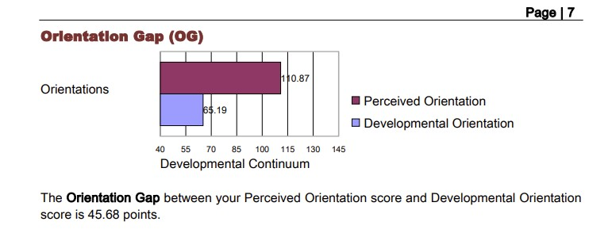
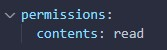
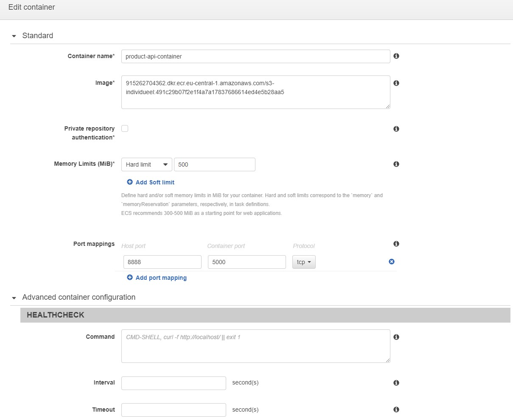

## Project: Warehouse Management System (WMS)

  

### Inleiding
In dit document vertel ik van begin tot eind wat voor project ik heb gemaakt in semester 3 en hoe ik dit technisch heb aangepakt van ontwerp tot realisatie.
Hiermee probeer ik de leeruitkomsten van dit semester aan te tonen.

Op verschillende plaatsen in dit document zijn afbeeldingen ingevoegd, deze dienen ter verduidelijking voor de geschreven tekst.

### Inhoudsopgave

-  [Inleiding](#inleiding)
-  [Projectbeschrijving](#projectbeschrijving)
-  [Agile](#agile)
   -  [Wat is Agile?](#wat-is-agile)
   -  [Verschillende Agile werkwijzen](#verschillende-agile-werkwijzen)
   -  [Agile toegepast binnen het groepsproject](#agile-toegepast-binnen-het-groepsproject)
   -  [Agile toegepast binnen het individuele project](#agile-toegepast-binnen-het-individuele-project)
-  [Professionele ontwikkeling](#professionele-ontwikkeling)
-  [Culturele verschillen](#culturele-verschillen)
-  [Ethiek](#ethiek)
-  [Business Process](#business-process)
-  [Onderzoek - Wat zijn API Keys & Hoe gebruik je ze veilig](#onderzoek---wat-zijn-api-keys--hoe-gebruik-je-ze-veilig)
-  [Requirements](#requirements)
-  [User Stories](#user-stories)
-  [Design](#design)
-  [Technische uitwerking](#technische-uitwerking)
    - [Frontend](#Frontend)
      -   [Mappenstructuur](#mappenstructuur)
      -   [Components](#components)
            - [Helper components](#helper-components)
            - [UI Components](#ui-components)
            - [Functionele Components](#functionele-components)
      -  [Router](#router)
      -  [Services](#services)
      -  [Store](#store)
      -  [Validations](#validations)
      -  [Views](#views)
      -  [Eindresultaat](#eindresultaat)
    - [Backend](#backend)
      -   [Mappenstructuur](#mappenstructuur)
      -   [Controllers](#controllers)
      -   [Interfaces](#interfaces)
      -   [Middlewares](#middlewares)
      -   [Models](#models)
      -   [Services](#services)
          -  [AWS S3](#aws-s3)
          -  [AWS Cloudfront](#aws-cloudfront)
      -   [Utils](#Utils)
          -   [Logger](#logger)
          -   [validateENV](#validateenv)
          -   [DBConnection](#dbconnection)
      -   [App & Server.ts](#server-&-app.ts)
          -   [App.ts](#app.ts)
          -   [Server.ts](#server.ts)
  - [Testen & Quality Assurance](#testen&qualityassurance)
    - [Integration Tests](#integration-tests)
    - [SonarCloud](#sonarcloud)
  - [Continuous Integration & Continuous Development](#continuous-integration-&-continuous-development)
    - [Docker](#docker)
    - [Github Actions](#github-actions)
      -   [Workflows](#workflows)
          -   [Jobs](#jobs)
              -   [Build](#build)
              -   [Deploy](#deploy)
    - [AWS ECR](#aws-ecr)
    - [AWS ECS](#aws-ecs)
    - [AWS EC2](#aws-ec2)

### Projectbeschrijving
In dit semester ben ik voor mijn individuele project begonnen aan een order/warehouse management tool. Met behulp van deze webapplicatie kunnen medewerkers alle processen binnen het warehouse beheren en overzichtelijk inzien.
Het is bijvoorbeeld mogelijk om producten, leveranciers en bestellingen te beheren en deze te koppelen aan voorraadlocaties zodat altijd duidelijk is waar welk product ligt opgeslagen. 
Ook is er de mogelijkheid om bestellingen te verwerken die binnenkomen via verschillende verkoopplatformen en/of webshops.

Het idee voor dit project is ontstaan vanuit mijn eigen bedrijf. Ik ben actief als verkoper op bol.com en heb dagelijks te maken met logstieke processen. Op dit moment gebruiken we daarvoor externe software, deze software werkt prima, alleen missen we soms wat functionaliteiten. Met behulp van dit project proberen we deze functionaliteiten zelf te ontwikkelen.

### Agile

#### Wat is Agile?
Agile is een methodiek die voornamelijk in de software development branch wordt gebruikt om een iteratief proces te beschrijven. Er wordt vaak gepland in verschillende sprints waarbij teams telkens een bepaald onderdeel opleveren en hier na afloop op reflecteren.

#### Verschillende Agile werkwijzen
Binnen Agile zijn er diverse werkwijzen die kunnen worden toegepast binnen een project. Elke werkwijze kan worden toegepast waar dit het meeste relevant is.
In dit voorbeeld heb ik 2 verschillende Agile werkwijzen uitgelegd:

  - Scrum:
  
  In Scrum werk je samen met een projectgroep in vaak kleine periodes van enkele weken aan een set taken die onderdeel uitmaken van een (groot)project. Deze periodes worden in Scrum termen sprints genoemd. Deze sprints zijn vooraf vastgestelde momenten waarop de projectgroep bij elkaar komt en zijn/haar voortgang van de taken presenteert aan de stakeholders.

  De stakeholders zijn vaak de belanghebbenden binnen het bedrijf waarvoor het project wordt uitgevoerd. Tijdens de sprintopleveringen kunnen zij feedback geven op de producten die worden opgeleverd door het ontwikkelteam.
  
  Als de stakeholders nog aanvullende wensen of eisen hebben dan kunnen zij deze doorgeven aan de Product owner. Hij is verantwoordelijk voor de communicatie tussen het ontwikkelteam en de stakeholders en maakt beslissingen voor het project. Ook kan de product owner de ontvangen feedback verwerken tot nieuwe taken voor de komende sprints.
  De verschillende taken worden in termen van Scrum vaak backlog items genoemd

  - Kanban:
  
  Deze Agile methode werkt op een totaal andere manier als Scrum. Bij Kanban werk je met een zogenoemd bord waarbij gebruik gemaakt wordt van simpele notities. Elke notitie representeert een andere taak. Het bord wordt opgebouwd met behulp van drie kolommen genaamd:

    - To Do (Taken die nog opgepakt kunnen worden en nog niet zijn gestart)
    - Doing (Taken waar op dit moment aan wordt gewerkt)
    - Done (Taken die zijn afgerond)

  Op deze manier is er een overzichtelijk overzicht in de nog openstaande taken en kunnen knelpunten snel worden opgespoord. Afhankelijk van de grootte van het project kan het bord nog worden uitgebreid met extra kolommen zoals een review kolom. 
  In deze kolom kunnen dan taken komen te staan die bijvoorbeeld nog eerst getest moeten worden alvorens ze worden verplaatst naar afgerond.

#### Agile toegepast binnen het groepsproject
In semester 3 hebben wij ook gewerkt aan een groepsproject samen met het bedrijf iO Digital in Eindhoven.

Voor dit bedrijf zijn wij het afgelopen semester bezig geweest met het ontwikkelen van een mobiele app waarbij de gebruikers van de app eenvoudig hun collega's kunnen tracken met behulp van hun locatie in het gebouw en de ingeplande afspraken.
Het doel van de app is om de productiviteit van de collega's op kantoor te verhogen, doordat zij gemakkelijker hun collega's kunnen vinden en hierdoor geen onnodige tijd verloren gaat.

Voor het projectmanagement hebben wij binnen het groepsproject gebruik gemaakt van de SCRUM methodiek die onderdeel is van Agile.
We hebben als eerste een DevOps board aangemaakt via Microsoft Azure, hierop staan alle User Stories en bijbehorende taken vermeld.

Hierna hebben we samen met de stakeholders besproken hoeveel sprints we voor dit project inplannen. Gezien de tijd van het semester en het aantal werkdagen in de week die zijn ingepland voor dit project zijn we uitgekomen op een totaal van 5 sprints met een interval van 3 (werk)weken, de vakantie zijn hierbij uitgesloten.
Deze sprintplanning hebben we vervolgens genoteerd in ons DevOps board.

Nadat we de afspraken met de stakeholders hebben gemaakt zijn we begonnen met het bedenken van user stories en hebben deze vervolgens verwerkt op ons DevOps board. Bij de verschillende user stories hebben we taken opgesteld die nodig zijn om een user story succesvol te kunnen afronden.

Bij elke taak hebben we samen met de groepsleden een D.O.D (Definition Of Done) opgesteld. Hiermee bepalen we gezamelijk wanneer wij als groep vinden dat een taak succesvol is afgerond en kan worden verplaatst.
Deze D.O.D is terug te vinden in de beschrijving van de taak

Ook hebben we een inschatting gemaakt hoeveel tijd we verwachten nodig te hebben om een taak te kunnen afronden. Deze tijd (in uren) staat in de taak vermeld bij Original Estimate. Wanneer de taak is afgerond hebben wij onze uiteindelijk besteede uren ingevoerd bij Completed.

We hebben gemerkt dat het plannen van taken in het begin nog lastig kan zijn. Bij veel van onze taken hebben we minder uren opgegeven dan dat we er uiteindelijk aan hebben besteed. 
Wel hebben we gemerkt dat het plannen van taken gedurende het semester steeds beter gaat en dat de inschattingen acqurater worden.

Verder hebben we in het begin onze taken erg groot en algemeen beschreven. Gedurende het project merkte we dat het toewijzen van taken aan individuele groepsleden op deze manier erg lastig ging worden. Ook hadden we geen goed overzicht wat er nog precies moest gebeuren om een taak volledig te kunnen afronden.
Om die reden hebben we de taken later in het project opgesplitst in kleinere losse taken die onderdeel zijn van een user story. 

Na enkele weken merkte we dat door deze aanpassing er een beter overzicht is gekomen en dat de productiviteit onder de groepsleden is toegenomen.

Op moment dat een sprint langzamerhand ter einde kwam zijn we begonnen met de voorbereidingen voor de sprintoplevering. We hebben een powerpoint presentatie gemaakt met daarin een korte samenvatting van de user stories waaraan we deze sprint hebben gewerkt en welke user stories we in de volgende sprint gaan oppakken. Ook hebben we bij elke oplevering een demonstratie gegeven van de huidige versie van het product.

Tijdens de sprintopleveringen waren de stakeholders Cas & Bart van het bedrijf aanwezig, alsmede onze coach vanuit Fontys. Na afloop van de demonstratie hebben feedbackpunten ontvangen die zijn genoteerd door de notulist van de groep. Deze feedbackpunten worden besproken in de retrospective en vervolgens meegenomen in de sprintplanning.

Na afloopt van elke sprintoplevering zijn we met de groep gaan refelecteren op de sprint in een zogenoemde retrospective. We hebben hierbij gebruik gemaakt van de 4 L's

  - Liked
  - Learned
  - Lacked
  - Longed For

In dit schema geven we aan welke zaken we konden waarderen (Liked), wat we afgelopen sprint hebben geleerd (Learned), maar ook minder goed zaken worden besproken in de Lacked kolom. Als laatste vertellen we wat we graag nog zouden willen bereiken in de volgende sprint (Longed For).

Nadat de retrospective is besproken met het team zal hier in Feedpulse een korte samenvatting over worden geschreven.
Deze samenvatting is een leidraad voor het gesprek met onze coach van de Fontys. Hij zal ons ook voorzien van feedback over de sprintoplevering.

Als laatste is de sfeer in het groepsproject ook erg belangrijk. Als er zaken spelen waarvan de andere groepsleden op de hoogte moeten zijn of als er minder goede dingen gebeuren dan moet dit bespreekbaar zijn.
Daarom doen we een aantal keren gedurende het project een peer review invullen. Hier kan elk groepslid aangeven wat hij/zij vindt van de inspanning en/of motvatie van de andere groepsleden.

Na afloop bespreken we de resulaten met iedereen en nemen we indien noodzakelijk de nodige maatregelen.

### Agile toegepast binnen het individuele project

Ook in mijn individuele project heb ik het Agile principe toegepast. Zo heb ik een Scrum board gemaakt met behulp van Jira. Op dit bord heb ik alle User stories met bijbehorende taken aangemaakt.

Op moment dat ik een taak heb afgerond heb ik deze op `Completed` gezet in de User Story

Omdat je in het invididuele project helemaal zelfstandig werkt aan een project is het toepassen van Agile hier een stuk moeilijker dan in het groepsproject.
Het scrum bord dient hier vooral voor structuur en een handige plek om taken te maken zodat ze niet worden vergeten. Terwijl in het groepsproject er wordt gewerkt samen met een team waarbij de taken eenvoudig kunnen worden verdeeld. Ook is dan in één oogopslag te zien waar welk teamlid mee bezig is.

### Professionele ontwikkeling

Profesionnele ontwikkeling is ook erg belangrijk als Software developer. Zowel binnen het groepsproject als het individuele project is dit veelvuldig teruggekomen.
Zo hebben we binnen het groepsproject afspraken gemaakt over de dagen en tijden dat we fysiek aanwezig zijn op de campus. Voor de online dagen zijn er ook afspraken gemaakt met betrekking tot de werktijden en de pauzes.
Op moment dat een groepslid verhinderd is om wat voor reden dan ook wordt dit tijdig gecommuniceerd via de aangewezen chatkanalen (Microsoft Teams)

Daarnaast hebben we ook afspraken gemaakt over wie de communicatie met de stakeholders bijhoudt. Dit gebeurd meestal via de e-mail, maar kan soms ook via Microsoft Teams. Elk teamlid wordt in de cc gezet van de e-mails zodat iedereen op de hoogte is van de communicatie en bijbehorende afspraken.

Ook in het individuele project komt het onderwerp profesionele ontwikkeling aanbod. Zo heb ik regelmatig feedbackgesprekken gevoerd met de coach van dit semester om samen te bespreken waar ik mee bezig ben of op vast loop. Een samenvatting van dit gesprek heb ik na afloop genoteerd in Feedpulse.

### Culturele verschillen

Aangezien wij in onze projectgroep geen internationale studenten hebben was het lastig om dit leerdoel te kunnen aantonen. Na een gesprek te hebben gehad met onze semestercoach zijn wij met de groep uitgenodigd om een online IDII Assessment te maken over culturele verschillen.

Tijdens dit assessment worden er in totaal 50 vragen gesteld die gaan over de cultuur verschillen tussen je eigen land en andere landen. Na afloop van het assessment wordt er met behulp van de antwoorden een Profile Report gemaakt waarin je kunt lezen hoe je omgaat met verschillende culturelen standpunten

In mijn preceived orientation score behaalde ik 110 punten, dit betekend dat ik in de categorie Minimization val. Deze categorie houd in dat je verschillende culturelen verschillen kunt inzien en benadrukken

Bij mijn Developmental Orientation Score behaalde ik maar slechts 65.19 punten, wat betekend dat ik in de categorie Denial val. Deze categorie houd in dat je de meer waarneembare culturele verschillen kunt herkennen zoals eten, kunst etc. Maar dat je de dieper gelegen culterele verschillen niet kunt opmerken zoals bijvoorbeeld conflicten of deze liever wilt vermijden.

Uit de test is gebleken dat mijn Orientation Gap (OG) op 45.68 punten verschil ligt. De OG score wordt gebaseerd op het verschil tussen de PO score (Preceived Orientation) en de DO Score (Developmental Orientation). Op moment dat de PO score hoger is dan de DO score heb je je eigen culturele vermogen overschat, op moment dat de DO score hoger is dan de PO score heb je je eigen culturele vermogen onderschat.

In mijn voorbeeld heb ik mijn eigen vermogen duidelijk overschat. Dit is terug te zien in de grafiek op het rapport.

Nadat het assessment met succes is afgerond kun je met behulp van de scores in het Profile Report een debrief opdracht maken. Deze opdracht sluit aan bij de Developmental orientation Score. Met behulp van deze interactieve videoopdracht worden de verschillen tussen de orientaties nader toegelicht. Er worden tussendoor in totaal 12 vragen gesteld om te kunnen toetsen of je begrijpt wat er wordt bedoeld met de verschillende orientaties.

Na afloop van de debrief ontvang je een persoonlijke score gebaseerd op het aantal goede antwoorden van de test.
In mijn geval had ik in totaal 10 van de 12 vragen goed beantwoord, wat neerkomt op een score van 83,33%.
Met dit resultaat ben ik erg tevreden.

Ook in het buitenland heb ik al een aantal culturele verschillen opgemerkt. Een voorbeeld hiervan is afgelopen zomer toen ik op rondreis was door Europa met de trein. Tijdens onze treinreis raakte we in gesprek met een echtpaar uit Nieuw-zeeland. Zij vertelden dat ze na een lange periode van lockdowns en coronamaatregelen eindelijk hun thuisland weer mochten verlaten om op reis te kunnen.

Ze waren vanaf Auckland naar Dubai gevlogen om daar over te stappen op een vliegtuig naar London. Vanaf London waren zij hun treinrondreis gestart richting Denemarken waar wij ze in de trein tegenkwamen. Vanwege een storing op het spoor had onze trein een behoorlijke vertraging opgelopen. Het echtpaar wist echter niet zeker of ze hun overstap in Duitsland nog gingen halen. 

Toen ze dat wilde navragen bij de conducteur reageerde hij boos en niet geïntereseerd. Het echtpaar vertelde ons dat ze al vaker hadden opgemerkt dat mensen in Europa totaal anders reageren als dat ze zelf gewend zijn in Nieuw-Zeeland.

Gedurende de treinrit raakte het echtpaar ook nog in gesprek met een man in Chicago. Hij vertelde dat hij een surfschool had en nodigde het echtpaar uit om eens langs te komen. Dit vond ik persoonlijk erg apart. De man in kwestie kenden de personen verder niet, en zij hadden hem nog nooit eerder gezien. Toch is de Amerikaanse cultuur in bepaalde staten een stuk opener en socialer dan in sommige andere landen.
In Nederland zouden we dit namelijk niet zo snel doen, bij ons wordt het als normaal gezien om eerst zogenoemd de kat uit de boom te kijken alvorens mensen een afspraak met iemand maken.

### Hofstede 
Als je zoekt over culturele verschillen kom je al snel de naam Hofstede tegen op het internet. Geert Hofstede (Geboren in 1928) was een Nederlandse psycholoog die bekend stond om zijn interculturele studies en het cultuurmodel.
Het cultuurmodel bestaat uit 6 verschillende dimensies waarbij in elke dimensie een ander culturele voorkeur nader wordt toegelicht en vergeleken. Het cultuurmodel is bedacht om de culturele verschillen tussen landen te vergelijken met andere culturen.

In dit voorbeeld heb ik 4 verschillende dimensies uitgewerkt en nader toegelicht.

1. Machtsafstand
De eerste dimensie in het model is machtsafstand. Hierbij wordt er gekeken naar de gelijkwaardigheid tussen de verschillende personen in de maatschappij.
Bij deze dimensie wordt er gekeken in hoeverre personen van minder machtige organisaties en/of bedrijven verwachten dat de macht mogelijk oneerlijk is verdeeld over de wereld.

Bij een grote machtsafstand vinden personen het belangrijk dat er een trap van macht is en er ongelijkheid heerst tussen deze verschillende groepen van macht. 

Bij een kleine machtsafstand vinden personen eerlijkheid het belangrijkste en streven naar een gelijk speelveld voor iedereen. Daarbij vinden ze ook dat machtsongelijkheid moet worden bestreden.

2. Individualisme

Bij individualisme wordt er gekeken naar de onderligende afhankelijkheid van een individueel persoon in de samenleving. Er wordt gekeken in welke mate het zelfbeeld kan worden ingedeeld in individualitisch (Ik vorm) of collectivistisch (wij vorm)

Bij samenlevingen waarbij het individualisme een belangrijke rol speelt wordt vanuit gegaan dat deze personen alleen voor zichzelf en hun directe naaste zullen zorgen. Terwijl in een collectivistische samenleving mensen zich verbonden voelen met een groep en voor elkaar zullen zorgen

3. Masculiniteit
De derde dimensie is Masculiniteit. Bij deze dimensie wordt onderzocht welke onderdelen binnen de maatschappij mensen motiveert om de aller beste te zijn. In een samenleving waarbij Masculiniteit een grote rol speelt zijn goede prestaties en succes erg belangrijk.

Het tegenovergestelde van Maculiniteit is Femininiteit. Hierbij wordt de nadruk gelegt op het onderhouden van relaties en minder op succes

4. Onzekerheidsvermijding
Bij de dimensie onzekerheidsvermijding wordt er onderzocht hoe groepen in de maatschappij omgaan met de gedachte dat hoe de toekomst eruit ziet niet bekend is.

Deze gedachte brengt bij de meeste groepen angst en onzekerheid en er wordt gekeken hoe de groepen reageren op deze onvoorspelbare situaties.

### Ethiek

Ethiek speelt in de wereld van Software ontwikkeling een grootte rol. Steeds meer applicaties worden slimmer ingericht en ook de hoeveelheid data die worden gedeeld neemt snel toe. Hoe zorgen we ervoor dat de software etesiche verantwoord blijft in deze snel veranderende sector? Wanneer is er sprake van onetische software? En wat kunnen we eraan doen?
Dat zijn allemaal relevanten vragen die gesteld kunnen worden.

Voor het onderzoek heb ik gebruik gemaakt van de Field research methode die onderdeel is van het DOT-Framework

Hoofdvraag: Hoe zorgen we ervoor dat er aan de ene kant een veilige werkomgeving wordt gecreërd en aan de andere kant de medewerkers de app op een goede manier kunnen blijven gebruiken?

Ook bij ons in het groepsproject speelt het etische vraagstuk een grootte rol. Voor iO Digital ontwikkelen wij een mobiele applicatie waarmee de medewerkers op kantoor andere medewerkers eenvoudig kunnen vinden. De locaties van de collega's worden bepaald aan de hand van de apparaten die zijn verbonden op de verschillende accesspoints die door het gebouw heen zijn geplaatst.

Met de app wordt het dus technisch gezien mogelijk dat collega's andere collega's voortdurend in de gaten kunnen houden en zo een locatiehistorie kunnen opbouwen van deze persoon. 

Deelvraag: Wat voor ethisch verantwoorde beveilingsoplossingen kunnen we hiervoor implementeren?

Over dit vraagstuk hebben wij de afgelopen maanden onderzoek gedaan. We zijn in gesprek geweest met de stakeholders van het project en hebben verder gesproken met de Legal afdeling over dit probleem. De resultaten van dit onderzoek hebben geleid tot een aantal beveiligingsoplossingen die we hebben geimplementeerd in de applicatie om deze zo veilig mogelijk te maken voor de gebruikers.

Zo hebben we onder andere afgesproken dat de ontvangen WiFi data maximaal 12 uur opgeslagen mag worden in de database. Elke invoer die langer dan 12 uur staat opgeslagen wordt automatisch door het systeem verwijderd. Dit zorgt ervoor dat de gegevens maximaal voor één werkdag worden bewaard en dat er geen historie wordt opgebouwd.

Ook kunnen collega's zelf bepalen of zij toestemming geven om hun locatie te delen met andere gebruikers. Deze toestemming kunnen zij ten alle tijden zelf aanpassen in de instellingen van de applicatie. Op moment dat er geen toestemming is verleend worden de locatiegegevens van deze persoon niet verwerkt. Indien gewenst kan de persoon alsnog handmatig zijn/haar locatie doorgeven.

Verder kunnen alleen medewerkers met een geactiveerd account inloggen in de applicatie. Een account aanmaken is alleen mogelijk met een e-mail adres van de organisatie die endigd op (@iodigital.com). Op deze manier zorgen we ervoor dat er geen onbevoegden toegang kunnen krijgen tot deze gevoelige gegevens.
Mocht een medewerker niet meer actief werken voor de organisatie dan kan de toegang tot de app eenvoudig worden ingetrokken.

Ten slotte zorgen we ervoor dat de API Server die deze gegevens verwerkt goed wordt beveiligd. Alle endpoints van de API kunnen alleen worden aangeroepen met een geldige accessToken. Deze accessToken wordt verleend op moment dat de gebruiker succesvol inlogd in de applicatie.
De overige endpoints zijn beveiligd met een API Key die gehashed staat opgeslagen op een veilige plek op de AWS Omgeving.
Op deze manier proberen we de aanvallen van buitenaf tot een minimum te beperken en zo datalekken te voorkomen.

Conclusie
Door middel van het inplementeren van diverse beveiligingsoplossingen kunnen we tijdens het gebruik van de app alsnog een veilige werkomgeving creëren.
De geimplementeerde beveiligingsoplossingen zijn besproken en goedgekeurd door de stakeholders van het project. Indien noodzakelijk worden deze in de toekomst aangevuld met extra eisen of worden bestaande eisen uitgebreid.

### Business Process

Voor het individuele project heb ik ook een aantal business processen uitgewerkt. Deze gaan over de situatie voor het gebruik van mijn applicatie en na het gebruik ervan. Op die manier is het verschil in proces goed te zien en daarmee ook de winst die er mee wordt behaald.

Bij de bovenstaande afbeelding is het proces uitgewerkt van een medewerker die een binnenkomende bestelling gaat inpakken. Hierbij wordt geen gebruik gemaakt van de applicatie die in ontwikkeling is. Alles wordt handmatig afgehandeld.
In het proces komt duidelijk naar voren dat er veel handmatige stappen nodig zijn om een bestelling te kunnen verwerken. Bij deze stappen is de kans op fouten erg groot omdat er nergens in het proces controles worden uitgevoerd.

Ook kosten sommige stappen in het proces, zoals het downloaden en schalen van een verzendlabel veel tijd en vertragen het proces onnodig. Dit kan ervoor zorgen dat er bij drukte en een lage bezetting niet genoeg tijd is om alle bestellingen op tijd te kunnen verwerken.

In het verbeterde proces hierboven wordt ervan uitgegaan dat de medewerker gebruikt maakt van de nieuwe software die wordt ontwikkeld. Dankzij het WMS Systeem zijn er veel minder handmatige stappen en wordt veel automatisch bepaald door het systeem. Zo weet het systeem bijvoorbeeld de afmetingen van de producten en kan op basis hiervan automatisch een doosformaat voorstellen.

Ook zijn er meer controles toegevoegd in het proces. Zo moet een medewerker de artikelen die zijn verzameld eerst scannen. Pas op moment dat alle bestelde artikelen overeenkomen met de gescande artikelen kan er een zending worden aangemaakt. Mocht er een fout optreden dan is op geen enkele manier mogelijk om de bestelling te kunnen afronden. 

Als laatste zijn veel handmatige stappen geautomatiseerd, zo worden pakbonnen en verzendlabels automatisch naar de printer verzonden op moment dat de medewerker deze nodig heeft in het proces. Handmatig schalen is ook niet meer nodig, de software doet dit voortaan geheel vanzelf.

Dankzij dit verbeterde proces wordt de kans fouten zo veel mogelijk verkleind en draagt het bij aan een betere KPI Score van bijvoorbeeld het retourpercentage doordat er mogelijk minder producten retour komen wegens een fout artikel in de zending.
Ook kunnen bestellingen nu veel sneller worden verwerkt dankzij de vele automatische stappen in het systeem. Dit zorgt ervoor dat alle bestellingen op tijd gereed zijn voordat ze worden opgehaald door de vervoerders. Hierdoor worden klanten niet teleurgesteld dat hun zending is vertraagd en zal de KPI score voor klanttevredenheid toenemen.

### Onderzoek - Wat zijn API Keys? & hoe gebruik je ze veilig?

In dit semester heb ik ook geregeld onderzoek gedaan naar de mogelijke oplossingen voor problemen die ik tijdens het programmeren ben tegengekomen.
Éen van deze onderzoeken gaat over API Keys en hoe ik deze veilig kan gebruiken in mijn code. Het onderzoek is opgebouwd aan de hand van een hoofdvraag en verschillende deelvragen. Op het einde geef ik een korte conclusie van de onderzoeksresultaten.

Voor het onderzoek heb ik gebruik gemaakt van de Lab research methode die onderdeel is van het DOT-Framework

Hoofdvraag: Hoe gebruik ik API Keys veilig in mijn code?
Om deze hoofdvraag goed te kunnen beantwoorden heb ik eerst verder onderzoek gedaan naar wat API Keys precies zijn en hoe deze worden gebruikt

Deelvraag: Wat is een API Key?

Een API Key is een soort wachtwoord waarmee gebruikers en/of applicaties zich kunnen identificeren bij een API Server. Deze key is opgebouwd uit een tekenreeks dat vaak via een speciale `crypto` library wordt aangemaakt om ervoor te zorgen dat deze altijd uniek is. Met behulp van een API Key kunnen gebruikers en applicaties toegang krijgen tot een API Server en daarmee de achterliggende functionaliteiten. 

Een API Key heeft 2 belangrijke taken:

  1. [Client App Identification](https://www.youtube.com/watch?v=sNn23dPRUS8)
  Hiermee worden de applicaties en/of gebruikers die een verzoek versturen naar de API Server geidentificeerd. De API Key is namelijk gekoppeld aan een gebruiker of applicatie en op moment dat er een inkomende request wordt verzonden naar de server kan deze controleren of de gebruiker wordt herkend in het systeem.

  2. [Client App Authorization](https://www.youtube.com/watch?v=sNn23dPRUS8)
  Hiermee wordt gecontroleerd of de gebruiker die een request verstuurd naar de API Server toegang heeft tot het gedeelte (endpoint) waar deze informatie van wilt ophalen. Op moment dat er geen toegang is verleend wordt er een foutmelding teruggestuurd en ontvangt de gebruiker geen informatie.

Deelvraag: Welke manieren zijn er om een API Key op te slaan in code?

In bijna iedere applicatie worden API Keys gebruikt om een gebruiker te identificeren bij een server. Er zijn verschillende manier om deze key te gebruiken binnen de codebase.
Hieronder heb ik de verschillende manieren nader toegelicht

API Key in code:

Het is mogelijk om een API Key direct te gebruiken binnen de codebase, bijvoorbeeld voor het ophalen van informatie bij een server. Vaak kan zo'n key worden meegegeven aan de `URL` van de server in de vorm van een `Query` parameter. 

Een voorbeeld hiervan is de API Server van OpenWeather voor het ophalen van de actuele weersinformatie. 
(https://api.openweathermap.org/data/2.5/weather?lat={lat}&lon={lon}&appid={API key})

Het direct meesturen van de API Key is een van de snelste en gemakkelijkste oplossingen voor het identificeren van de gebruiker bij een externe dienst. 
Echter is dit ook de meest onveiligste implementatie omdat de API Key op deze manier direct in de code terecht komt en daardoor eenvoudig kan worden gelekt op moment dat de codebase wordt gedeeld op een `Source Control System` zoals GitHub.

Op moment dat een API Key is gelekt kan iedereen die de key in handen krijgt requests maken naar de externe dienst en daarmee toegang krijgen tot onbevoegde informatie. Dit kan voor privacy problemen zorgen en daarnaast kan het in geval van een betaalde dienst leiden tot onnodig extra kosten (Bijvoorbeeld als een API Server je factureert per gemaakt request)

API Key opslaan in Enviroment variabelen.

Een andere optie voor het opslaan van API Keys in de code is door gebruik te maken van enviroment variablen. Deze variabelen staan vaak opgeslagen in een `.env` betand en werken met een `key-value pair`. 
Nadat een enviroment variable is aangemaakt en er een waarde aan is toegekend kan deze in de code worden uitgelezen met behulp van `process.env.<Variable naam>` 

Op deze manier zijn de API Keys niet direct zichtbaar in de code aangezien de applicaie op de achtergrond de `process.env` variable vervangt met de daadwerkelijke inhoud ervan.
Door gebruik te maken van `.env` variabelen kan de code ook veilig worden gedeeld op een `Source Control System` zoals GitHub aangezien de codes niet direct zichtbaar zijn.

Wel is het van belang dat het `.env` bestand niet wordt meegenomen in de codebase, anders kunnen onbevoegden nog altijd toegang krijgen tot de gevoelige API Keys. Dit kan worden voorkomen door het `.env` bestand toe te voegen aan de `.gitignore` lijst.

API Key opslaan bij een externe hosting services

Nadat een applicatie gereed is om te worden gebruikt in productie wordt deze uitgerold op een externe server (Vaak van derde partijen). Tijdens het configureren van deze server is het mogelijk om de enviroment variabelen in te voeren in het configuratieoverzicht.

Deze configuratie zorgt ervoor dat er intern op de server een nieuw `.env` wordt aangemaakt en dat de variabelen daarin worden toegevoegd. Aangezien het `.env` bestand niet gedeeld mag worden op een `Source Control System` zoals Github is het namelijk niet mogelijk om deze variabelen op een andere manier op te halen.

Deze optie is erg handig voor een backend server zoals een API aangezien er geen frontend beschikbaar is en de gebruiker niet direct kan interacteren met de applicatie. 
Voor een frontend applicatie is deze optie erg onveilig aangezien de `.env` variabelen door de server weer worden toegevoegd in de code en iedereen die de applicatie gebruikt deze codes weer kan inzien in de browser.
Op dat moment wordt hetzelfde bereikt als een API Key direct in code meegeven en kan iedereen dus toegang krijgen tot deze externe services.

Voor een frontend applicatie kan het beste gebruik worden gemaakt van een eigen gemaakte API die dient als een soort `Proxy` voor het afhandelen van de requests. Op die manier wordt via de eigengemaakte API server een request gemaakt naar de externe dienst en wordt de ontvangen data teruggestuurd naar de frontend. 
Bij het gebruik hiervan is het wel van belang om deze `Proxy` API te beveiligen met een eigen gemaakte API key zodat niemand zomaar requests kan sturen naar deze server.

Conclusie:

Het veiligste is om de API Keys te bewaren in `.env` variablen en deze op de juiste wijze te gebruiken in de code. Wel moet het `.env` bestand worden uitgesloten van de codebase zodat deze niet wordt gedeeld op een `Source Control System` zoals GitHub.

Daarnaast is het belangrijk om bij het configureren van de server alleen de enviroment variabelen in te stellen voor backend servers waarbij er geen frontend aanwezig is. 
Voor de frontend kan gebruik worden gemaakt van een eigen gemaakte API Server die dient als `proxy` voor het afhandelen van de requests bij externe diensten

De resultaten van dit onderzoek heb ik gebruikt om de API Keys in mijn eigen project en het groepsproject voor iO Digital veilig te kunnen verwerken in de applicatie. We hebben de implementatie gevalideerd bij de stakeholders van het bedrijf en hebben na enkele aanpassingen hierop goedkeuring ontvangen.

### Requirements
Klanten
  -	Een medewerker kan een nieuwe klant toevoegen in het systeem
  -	Een medewerker kan een bestaande klant aanpassen in het systeem.
  -	Een medewerker kan een bestaande klant verwijderen uit het systeem.
  -	Er kan een export gemaakt worden van alle klanten uit het systeem.

Producten
  -	Een medewerker kan een nieuw product toevoegen in het systeem. 
  -	Een medewerker kan een bestaand product aanpassen in het systeem
  -	Een medewerker kan een bestaand product op in-actief zetten in het systeem.
  - Een medewerker kan een bestaand product verwijderen uit het systeem. 
  -	Een medewerker kan een bestaand product koppelen aan een voorraadlocatie. 
  -	Een medewerker kan een bestaand product koppelen aan een leverancier
  -	Er kan een export gemaakt worden van alle producten uit het systeem.

Leveranciers
  -	Een medewerker kan een nieuwe leverancier toevoegen aan het systeem
  -	Een medewerker kan een bestaande leverancier aanpassen in het systeem.
  -	Een medewerker kan een bestaande leverancier verwijderen uit het systeem.
  -	Er kan een export gemaakt worden van alle leveranciers.
 
Bestellingen
  -	Een medewerker kan een nieuwe bestelling toevoegen in het systeem.
  -	Een medewerker kan een bestaande bestelling aanpassen in het systeem.
  -	Een medewerker kan een bestaande bestelling annuleren in het systeem.
  -	Een medewerker kan een bestelling verwerken in het systeem.
  -	Een medewerker kan een verzendlabel aanvragen bij de vervoerder.
  -	Er kan een export gemaakt worden van alle bestellingen.

Voorraadlocaties
  -	Een medewerker kan een nieuwe voorraadlocatie aanmaken in het systeem
  -	Een medewerker kan een bestaande voorraadlocatie aanpassen in het systeem.
  -	Een medewerker kan een bestaande voorraadlocatie verwijderen uit het systeem
  -	Er kan een export gemaakt worden van alle voorraadlocaties.

### User Stories
Producten
  - Als een gebruiker wil ik nieuwe producten kunnen toevoegen aan het systeem :white_check_mark:
  - Als een gebruiker wil ik bestaande producten kunnen wijzigen in het systeem
  - Als een gebruiker wil ik een bestaande product kunnen verwijderen uit het systeem :white_check_mark:
  - Als een gebruiker wil ik alle producten uit het systeem kunnen inzien :white_check_mark:
  - Als een gebruiker wil ik een bestaand product op non-actief kunnen zetten :white_check_mark:

Klanten
  - Als een gebruiker wil ik een nieuwe klant kunnen toevoegen aan het systeem
  - Als een gebruiker wil ik een bestaande klant kunnen aanpassen in het systeem
  - Als een gebruiker wil ik een bestaande klant kunnen verwijderen uit het systeem
  - Als een gebruiker wil ik een overzicht hebben van alle klanten
  
Voorraadlocaties
  - Als een gebruiker wil ik nieuwe voorraadlocaties kunnen aanmaken in het systeem
  - Als een gebruiker wil ik bestaande voorraadlocaties kunnen aanpassen in het systeem
  - Als een gebruiker wil ik bestaande voorraadlocaties kunnen verwijderen uit het systeem
  - Als gebruiker wil ik een bestaand product kunnen koppelen aan een voorraadlocatie
  - Als een gebruiker wil ik een overzicht hebben van alle voorraadlocaties

Voorraad
  - Als een gebruiker wil ik de voorraad van een product kunnen wijzigen in het systeem

Verkoopkanalen
  - Als een gebruiker wil ik mijn producten kunnen doorsturen naar verschillende marketplaces

Leveranciers
  - Als gebruiker wil ik een leverancier kunnen koppelen aan een artikel

Dashboard
  - Als een gebruiker wil ik een dashboardpagina hebben waarop ik alle belangrijke informatie kan inzien

### Design

Voor het design van mijn invididuele applicatie heb ik als eerste onderzoek gedaan naar de verschillende WMS Systemen die inmiddels op de markt te verkrijgen zijn. Hierbij heb ik voornamelijk gelet op de de verschillen en gelijkenissen binnen het design, maar ook naar de verschillen in functionaliteiten onder de systemen.

Er zijn tegenwoordig een heleboel WMS Systemen te gebruiken die allemaal ongeveer hetzelfde werken. De meeste systemen zijn klein en bevatten alleen basisfunctionaliteiten zoals het beheren van producten en het opboeken van voorraad.
De 2 grootste systemen die ik ben tegengekomen zijn Picqer en GoedGepickt. Deze softwareproducten bevatten functionaliteiten voor zowel kleine als grotere warehouses en bieden veel meer koppelingen om alles te kunnen automatiseren.

Het design van mijn applicatie is gebaseerd op een combinatie van deze 2 systemen. Zo werkt Picqer vooral met diverse zoegenoemde `cards` op een webpagina met op elke card een ander stukje informatie. Dit zorgt ervoor dat alles erg overzichtelijk wordt weergegeven op het scherm en dat er geen onduidelijkheden kunnen zijn, dit is erg cruciaal in een warehouse.

Bij GoedGepickt wordt op sommige momenten meer gebruik gemaakt van tabellen. Dit zorgt ervoor dat alleen de benodigde informatie wordt weergegeven op de pagina en de informatie daardoor veel compacter kan worden getoond. Dit vond ik zelf erg onhandig aangezien je dan erg goed moet zoeken naar de gewenste informatie, dit lijkt me in een warehouse niet efficient.

Ook over de kleurstelling van de applicatie heb ik nagedacht, zo heb ik al eerste ideeën opgedaan met een colorpicker die ik online tegen ben gekomen. Deze software genereerd verschillende kleurenpalleten die bij elkaar passen. Jammer genoeg ben ik hier geen kleurenpallet tegengekomen die het beste aansluit bij de applicatie en het gevoel wat ik ermee wil uitstralen

Aangezien de applicatie gebaseerd is op mijn eigen onderneming leek het mij het leukste om de kleuren uit het logo te gebruiken op verschillende plekken in de applicatie.
Deze kleuren bestaan uit twee tinten blauw, lichtblauw (#00A9FA) en donkerblauw (#1C5CA1)

Verder maak ik voor het lettertype gebruik van `Roboto`. Dit lettertype wordt ook gebruikt op de facturen die worden verzonden aan klanten en past dus mooi binnen het design

De gemaakte keuzes voor het design heb ik laten valideren door meerdere gebruikers. Daaruit is naar voren gekomen dat het gebruik van oranje als secundaire kleur niet past binnen het design van de applicatie. Ook waren de melding kleuren van succes, warning en error erg dof, deze mochten wat feller worden. Dankzij de ontvangen feedback is het design verder aangepast en zie het eindresultaat er alsvolgt uit

Voor de navigatiebalk is gekozen om de achtergrondkleur in te stellen op de donkerblauwe kleur die onderdeel is van het logo. De tekst heeft een witte kleur zodat deze op de donkere achtergrond goed leesbaar blijft. Verder heeft maakt de tekst gebruik van het lettertype Roboto wat onderdeel is van het design.

Voor het toevoegen van het product is gebruik gemaakt van de losse `cards` waar ik inspiratie van heb gekregen dankzij de software Picqer. Verder heb ik gebruik gemaakt van het lettertype Roboto voor zowel de tekst als de invoervelden. 
De meldingen op de pagina waarvoor het voor de gebruiker belangrijk is om hier op te letten hebben een gele warning kleur gekregen die een stuk feller is. 

De knoppen `Kies afbeelding`en `Velden leegmaken` hebben de kleuren van het logo gekregen, de knop `Product aanmaken` heeft de groene succeskleur gekregen. Deze kleur laat zien dat de gebruiker het beste op de knop kan klikken voor het afhandelen van de gewenste actie.

Daarnaast heb ik voor mijn individuele applicatie ook een C4 Model (Container Diagram) gemaakt. Hierin wordt in één oogopslag duidelijk hoe de applicatie is opgebouwd en met welke services deze communiceert.

Voor het groepsproject hebben we veel gewerkt met diverse AWS Services. 
Hiervoor hebben we een AWS Diagram gemaakt waarin de verschillende services en de communicatie tussen deze services duidelijk zichtbaar zijn.

## Technische uitwerking

### Frontend
De front-end van de webapplicatie heb ik ontwikkeld in Vue.js in combinatie met Javascript. Vue.js is een erg klein framework waardoor het snel te gebruiken is. Daarnaast werkt Vue.js met zogenoemde components, hierdoor kan je gemakkelijk bepaalde functionaliteiten opsplitsen en later hergebruiken binnen het project zonder de code ervan opnieuw te hoeven schrijven. Dit zorgt ervoor dat je code onderhoudbaarder wordt en daardoor ook leesbaarder.

In de afgelopen jaren heb ik al aan meerdere projecten gewerkt die in Vue.js zijn geschreven, onder andere tijdens mijn eerdere stages. Hierdoor ken ik de basis van Vue.js erg goed en wil ik mij verder verdiepen in de geadvanceerde onderdelen binnen dit framework.

Binnen Vue.js gebruik ik ook een aantal npm packages, dit zijn uitbreidingen (Vaak van derde partijen of developers) die je kan toevoegen om extra functionaliteiten out-of-the-box the gebruiken zonder het zelf te hoeven schrijven.

Voor mijn project gebruik ik de volgende packages

  - [Axios](https://www.npmjs.com/package/axios) (Voor het maken van HTTP Requests naar mijn backend)
  - [Vuex](https://vuex.vuejs.org/) (Vue.js State management, voor het delen van data tussen verschillende components)
  - [VueRouter](https://router.vuejs.org/) (Vue.js Router Plugin, voor het navigeren tussen verschillende Views/Components)
  - [Yup](https://www.npmjs.com/package/yup) & [Vee-validate](https://vee-validate.logaretm.com/v4/) (Voor de invoervalidatie op de front-end)
  - [FontAwesome](https://fontawesome.com/) (Voor de mooie icoontjes binnen het project)

Voor de CSS gebruik ik [Semantic UI](https://semantic-ui.com/) als UIKit, ik vind dit persoonlijk zelf een erg mooi framework, het ziet er zakelijk uit, iets wat erg goed past binnen het project. De documentatie van Semantic UI is erg duidelijk en er bestaan zelfs Vue.js components die je direct kan gebruiken.

Ik heb in het begin ook gewerkt met [Tailwind CSS](https://Tailwindcss.com), deze UIKit vind ik zelf erg lastig om te gebruiken. De documentatie is duidelijk maar er zijn vaak geen bruikbare components die je gemakkelijk kan importeren in het project. bij TailwindCSS moet je deze zelf ontwikkelen en stylen. Omdat dit buiten de scope van dit project valt heb ik besloten om TailwindCSS niet te gebruiken. Hiermee ga ik in een ander project mee verder.

#### Mappenstructuur

Voordat ik ben begonnen met het bouwen van de frontend voor mijn applicatie heb ik eerst onderzoek gedaan naar een goede mappenstructuur. Tijdens het werken met een component gebaseerd framework komen er al snel heel veel verschillende bestanden bij kijken. 

Om het overzicht niet kwijt te raken is een goede structuur cruciaal. Afhankelijk van de grootte van het project zijn daar verschillende mogelijkheden voor, zo kun je bijvoorbeeld alles groeperen op basis van een functionaliteit (Bijvoorbeeld alles van producten in een map zetten) of je kunt alle onderdelen van een applicatie splitsen (Bijvoorbeeld componenten, logica etc). 

Voor dat laatste heb ik gekozen aangezien deze variant het beste past bij het project. Ook vind ik dit persoonlijk het overzichtelijkst.

De mappenstructuur bestaat als eerste uit een aantal hoofdmappen zoals `node_modules` en `public`.
In de map node_modules komen alle geïnstalleerde packages van de npm package manager te staan. Zoals de packages eerder genoemd hierboven. 

In de public map staat het start `index.html` bestand en een favicon. Deze bestanden zijn de start van de applicatie.

Het hart van de applicatie staat in de `src` map. Hierin heb ik een aantal submappen gemaakt waarvan verschillende onderdelen van de applicatie staan.
De submappen bevatten de volgende bestanden:

  - in de `assets` map staan alle illustraties en stylesheets, denk hierbij aan afbeeldingen, CSS Bestanden, video's etc.

    

  - in de `components` map staan alle losse components die ik gebruik in mijn applicatie. 
    
    Deze components heb ik verder opgesplitst in UI components, Helper components en functionele components. 
    UI Components bouwen de grote onderdelen van de applicatie, zoals de NavBar, Footer etc. (`NavBar.vue`, `PaginationBox.vue`, `StatusBar.vue`)
   
    De helper components zijn components die door het gehele project gebruikt kunnen worden gebruikt en dienen als ondersteuning. Een voorbeeld hiervan is bijvoorbeeld een dropdownlijst. (`CountrySelector.vue`, `ImageSelector.vue`, `VATSelector.vue`)

    Als laatste heb ik de components voor elke functionaliteit ook opgesplist. In de map `product` bevinden zich componenten die te maken hebben met alles omtrent de functionaliteit product, zoals bijvoorbeeld het aanmaken van een product (`CreateProduct.vue`) of de weergave van het Product (`Product.vue`)

    

  - in de `router` map staat het configuratiebestand van de npm package `VueRouter`. 
    Hierin worden de verschillende routes gedefinieerd waar de gebruiker naar toe kan navigeren in de applicatie, zoals bijvoorbeeld  `/create-product` of `/products`

    

  - in de `services` map staat de logica van de applicatie. Hier worden bijvoorbeeld de requests naar de backend opgebouwd met behulp van de npm package `axios`.

    

  - in de `store` map staat het configuratiebestand van de npm package `Vuex`. 
    Hier wordt bepaalde data opgeslagen in de state van de applicatie zodat verschillende components gegevens met elkaar kunnen uitwisselen. 
    Deze store heb ik opgesplitst in losse modules zodat elke functionaliteit zijn eigen store heeft waarin data wordt opgeslagen. Dit maakt het erg overzichtelijk.

    

  - in de `validations` map staat het validatieschema voor het formulier dat wordt gebruikt om een nieuw product aan te maken. 
    Met behulp van de npm package `yup` kan je erg gemakkelijk validatieregels toevoegen voor elk afzonderlijk invoerveld. Deze invoerregels worden met behulp van de npm package `vee-validate` gecontroleerd zodra de gebruiker iets invoert in het formulier.

    

  - in de `views` map staan de daadwerkelijke pagina's die wordt geladen door de applicatie met behulp van de router. 
    Op de pagina worden de verschillende componenten die benodigd zijn ingeladen.

    

  Als laatste zijn er nog een aantal belangrijke bestanden die los in de hoofdmap staan. Dit zijn `main.js` en `.env`. 
  
  Het `main.js` bestand wordt gebruikt om alle losse bestanden te combineren tot een werkende Vue applicatie.
  Zo worden hier bijvoorbeeld verschillende dependencies ingeladen en wordt de Vue app gekoppeld aan het `index.html` bestand die we eerder in de `public` map hebben zien staan.

  

  In het `.env` bestand worden gevoelige gegevens opgeslagen die je liever niet in de code hebt staan. 
  In Vue.js moet elke env variable beginnen met de prefix `VUE_APP_` gevolgd door een eigen gekozen naam. 
  
  

  Deze variabelen worden in de code gebruikt om de waardes van de variable uit te lezen. Als de code naar een versiebeheersysteem zoals GitHub wordt gepusht wordt dit bestand uitgesloten zodat niemand toegang kan krijgen tot deze gegevens.

#### Components

Om de frontend op te bouwen maak ik gebruik van zogenoemde components. Dit zijn eigenlijk kleine afzonderlijke stukjes code die door het gehele project (her)gebruikt kunnen worden. Dit is erg handig voor als je een bepaald component verwacht vaker te gaan gebruiken. 

Op die manier hoef je de code maar één keer te schrijven en bij een aanpassing wordt hij overal waar het component wordt gebruikt direct bijgewerkt. Daarnaast draagt het bij aan een goede onderhoudbare en overzichtelijke applicatie.

Elk component in Vue.js is opgebouwd op dezelfde manier. Zo start een component met de `template` tag. Elke template tag moet minstens één `root` element bevatten zoals een `div` tag. Binnen het `root` element kan vervolgens HTML code worden geschreven.

Als tweede wordt er een `<script>` tag toegvoegd. Binnen deze tag wordt alle Javascript code geschreven. Ook kunnen er bijvoorbeeld functies worden aangemaakt of een lokale `state` voor het opslaan van data binnen het component.

Als laatste wordt er een `style` tag toegevoegd voor het stylen van het component met behulp van `CSS` selectors. Binnen deze tag kun je normale CSS code schrijven. De `style` tag heeft 2 opties. `scoped` en `normaal`. 

Bij de `scoped` variant wordt de CSS code alleen toegepast op de HTML code binnen hetzelfde component. Mocht bijvoorbeeld een bepaalde klasse of element elders op de webpagina  voorkomen dan wordt de CSS code niet toegepast op deze elementen.

Bij de normale variant wordt de CSS code ook buiten het specifieke component gebruikt. Het kan dus voorkomen dat de styling van elementen wordt overschreven. 

##### Helper components

Voor de structuur heb ik verschillende soorten components gemaakt die gebruikt kunnen worden. Als eerste ben ik bezig geweest met helper components. Dit zijn componenten die overal gebruikt kunnen worden en die een bepaalde functionaliteit versterken of uitbreiden. Een voorbeeld hiervan is `CountrySelector.vue`

Dit component is een HTML dropdown menu waar alle landen van de wereld in getoond kunnen worden. Het component maakt een connectie met de backend voor het ophalen van deze landen en verwerkt de data in een overzichtelijke lijst.
Aangezien dit component niet specifiek tot een functionaliteit behoort maar wel een functionaliteit kan versterken heb ik dit component in de map Helper components geplaatst.

##### UI Components

Als tweede heb ik UI Components gemaakt. Deze components zijn specifiek bedoeld voor het opbouwen van de lay-out van een webpagina. Denk hierbij aan een NavBar (`NavBar.vue`) of Pagination (`PaginationBox.vue`)
Deze components komen op elke nieuwe webpagina terug en worden altijd op dezelfde manier gebruikt.

##### Functionele Components

Als laaste heb ik Functionele components gemaakt. Dit zijn components die specifiek bedoeld zijn voor de werking van de applicatie en behoren tot een bepaalde functionaliteit. Een voorbeeld hiervan is bijvoorbeeld (`CreateProduct.vue`) voor het aanmaken van een product of (`Product.vue`) Voor het weergeven van een specifiek product.

#### Router

Om eenvoudig tussen de verschillende webpagina's te navigeren is een zogenoemde `router` nodig. Deze router koppelt een specifiek pad in de browser aan een webpagina en de bijbehorende Vue componenten. Om dit voorelkaar te krijgen gebruik ik de package `VueRouter`. Met behulp van dit pakket kan ik in het configuratiebestand instellen welk pad naar welke pagina of component gaat.

Het gebruik ervan is erg simpel. Er is een hoofdobject waar de routes in gedefinieerd kunnen worden.
Elke route bevat een aantal property's zoals:

  - `path` Dit is het pad in de browser
  - `component` Dit is het component die wordt gekoppeld aan het pad
  - `name` Dit is de naam van de route, deze kun je bijvoorbeeld weergeven op het tabblad in je browser

De functie `router.beforeEach` kan vervolgens de titel van het tabblad aanpassen naar de naam van de route die je hebt gespecificeerd in de `name` property van het route object.

#### Services

De logica van de applicatie is opgesplitst in verschillende services. Elke functionaliteit heeft zijn eigen service. In zo'n service kan vanalles gebeuren, zo kunnen er berekeningen worden uitgevoerd of bijvoorbeeld requests worden verstuurd naar de backend.

In het voorbeeld op de afbeelding zijn er verschillende functies aangemaakt binnen de klasse `ProductService` 
Al deze functies halen of versturen data naar de backend server. Omdat het erg belangrijk is om te wachten op een antwoord van de server zijn deze functies `async` (asynchronous) gemaakt. Hierdoor stopt de code tijdelijk met lopen totdat ze een antwoord hebben ontvangen van in dit geval de backend server.

Mocht er tijdens de operatie iets verkeerd gaan dan wordt de foutmelding netjes afgevangen en doorgestuurd naar de gebruiker.

#### Store

Standaard kunnen componenten alleen data opslaan binnen de state van het component en hebben andere componenten geen toegang tot deze data. Om het mogelijk te maken dat componenten data met elkaar kunnen uitwisselen is er een package gemaakt genaamd `Vuex`.
Vuex zorgt ervoor dat er een `state` management is op een algemene plek in het project, buiten de componenten.

Alle componenten kunnen data naar deze `state` toesturen en opvragen. Dit zorgt ervoor dat componenten op een gemakkelijke manier data met elkaar kunnen uitwisselen en zo kunnen inspelen op bepaalde acties.

De `Vuex` state is op de volgende manier opgebouwd:

  - `getters` met behulp van een getter kan een component data uit de state opvragen

  

  - `state` hierin wordt de data opgeslagen zodat alle components deze kunnen opvragen

  

  - `actions` met behulp van een action kan een component data naar de state toesturen

  

  - `mutations` met behulp van een mutation kan de data worden opegeslagen in de state

  

  - `modules` mocht de state te groot worden dan is het met `modules` mogelijk om meerdere losse states te maken. Dit is ook erg handig voor de onderhoudbaarheid van de    applicatie. Zo heb ik in mijn voorbeeld een aparte module gemaakt voor alles wat met de functionaliteit product te maken heeft.

#### Validations

Het is erg belangrijk dat de invoer die de gebruik opgeeft in bijvoorbeeld een formulier voldoet aan de gewenste invoer. Om dit te controleren heb ik gebruik gemaakt van een schema validation package genaamd `yup`. Met behulp van deze package kan je heel eenvoudig regels opstellen voor elk afzonderlijk invoerveld.

In het voorbeeld op de foto is te zien dat bijvoorbeeld het invoerveld `productName` moet voldoen aan de volgende regels:

  - De invoer moet van het datatype `string` zijn.
  - De invoer is `required`
  - De lengte van de invoer mag maximaal `50` tekens zijn,
  - De waarde `null` is toegestaan (`nullable`)

Als de invoer niet voldoet aan de ingestelde regels dan wordt de meegestuurde foutmelding getoond aan de gebruiker.
Dit ziet er alsvolgt uit:

Voor het controleren van de invoer heb ik gebruik gemaakt van de package `vee-validate` Deze package heeft mijn validation schema van `yup` ingeladen en kan op die manier controleren of de invoer voldoet aan de gestelde eisen.

#### Views

Om alle losse componenten in te laden op de webpagina maak ik gebruik van `views`. Deze views zijn de pagina's die de gebruiker te zien krijgt en worden via de router weergegeven op moment dat een gebruiker het desbetreffende pad intypt in de browser.

#### Eindresultaat

Hieronder heb ik een aantal korte gifjes toegevoegd die de werking van mijn applicatie demonstreren. Deze worden verder aangevuld na mate er meer functionaliteiten worden afgerond.

 - Het toevoegen van een nieuw product in het systeem
   

 - Het ophalen van alle producten uit het systeem
   

 - Het product activeren / deactiveren in het systeem
   

 - Het verwijderen van het product in het systeem
   

### Backend

De backend voor de webapplicatie bestaat uit voor nu uit één enkele REST API voor het beheren van alles omtrent producten. Het is de bedoeling dat er uiteindelijk meerdere losse REST API's (Microservices) komen. Het doel hiervan is dat elke REST API verantwoordelijk is voor een eigen taak. De verschillende API's kunnen intern aan elkaar gekoppeld worden indien ze gegevens moeten uitwisslen.

De REST API's worden ontwikkeld in Node.js in combinatie met TypeScript en Express.js

Express.js is een framework voor Node.js dat specifiek bedoeld is voor het bouwen van REST API's. Express werkt op basis van JavaScript, net zoals de frontend in Vue.js. Dit zorgt ervoor dat zowel frontend als backend in dezelfde taal worden ontwikkeld. Daarnaast is het hier ook mogelijk om de npm package manager te gebruiken voor het installeren van diverse packages.

Voor het opslaan van data maak ik gebruik van `MongoDB` Dit is een NoSQL database en is erg handig voor het opslaan van veel ongestructuurde data. 
Het is ook mogelijk om een aantal simpele relaties te maken met behulp van zogenoemde `ObjectIds` 

Aangezien in mijn applicatie voor nu niet veel relaties zitten en er alleen productinformatie wordt opgeslagen leekt het mij een goed idee om hiervoor te kiezen.

Voor de backend maak ik verder nog gebruik van de volgende packages:

  - [AWS-SDK](https://www.npmjs.com/package/aws-sdk) (Voor de verbinding met de live AWS omgeving)
  - [body-parser](https://www.npmjs.com/package/body-parser) (Voor het weergeven van extra informatie afkomstig van een HTTP Request)
  - [cors](https://www.npmjs.com/package/cors) (Voor het beheren van de CORS Instellingen)
  - [dayjs](https://day.js.org/) (Een package voor het manipuleren van datums / tijden)
  - [dotenv](https://www.npmjs.com/package/dotenv) (Voor het beheren van de .env enviroment variables)
  - [envalid](https://www.npmjs.com/package/envalid) (Voor het valideren van de .env enviroment variables)
  - [express](https://www.npmjs.com/package/express) (Voor het opzetten van de Express server)
  - [jest](https://www.npmjs.com/package/jest) (Voor het uitvoeren van de integration tests)
  - [joi](https://www.npmjs.com/package/joi) (Voor het maken van de validatieschema's om data te kunnen valideren)
  - [mongodb-memory-server](https://www.npmjs.com/package/mongodb-memory-server) (Voor het opzetten van een Mock instantie van MongoDB, deze wordt gebruikt binnen de tests)
  - [mongoose](https://www.npmjs.com/package//mongoose) (Voor het verbinden met de live MongoDB server)
  - [pino](https://www.npmjs.com/package/pino) & [pino-pretty](https://www.npmjs.com/package/pino-pretty?activeTab=readme) (Voor het maken van een duidelijk log melding in de console)
  - [supertest](https://www.npmjs.com/package/supertest) (Voor het maken van de integrationtests)
  - [uuid](https://www.npmjs.com/package/uuid) (Voor het creëren van unieke UUID's)

#### Mappenstructuur

Ook voor de backend heb ik onderzoek gedaan naar een handige mappenstructuur. Persoonlijk vind ik het fijn om dezelfde mappenstructuur aan te houden als de frontend applicatie. Dit maakt het voor mij erg overzichtelijk. 

Om die reden heb ik ook bij de backend applicatie mijn mappenstructuur opgedeeld op basis van de verschillende onderdelen van de API.

Ook hier bestaat de mappenstructuur uit een aantal hoofdmappen zoals `.github` `aws` `.localstack` en `node_modules`
Deze mappen bevatten de volgende bestanden:

  - In de map `.github` wordt het configuratiebestand van mijn Github workflow bewaard. Hierin staan de verschillende jobs van de workflow beschreven

  
  
  - In de map `aws` wordt het configuratiebestand van mijn AWS ECS Task Definition bewaard. Dit bestand wordt gebruikt om tijdens de CI/CD Workflow de nieuwe container te kunnen deployen op een virtuele EC2 machine binnen het platform van Amazon (AWS)

  

  - In de map `.localstack` worden de configuratiebestanden bewaard van mijn LocalStack docker container. Met behulp van LocalStack kan ik lokaal & zonder kosten diverse AWS services mocken en dus testen voordat deze op de live omgeving worden gebruikt.

  

Het hart van de applicatie staat in de map `.src` Deze map bevat volgens weer 2 mappen genaamd `api` en `tests`. 
In de map `api` staan alle bestanden van de daadwerkelijke REST API.

In deze map heb ik ook weer diverse submappen gemaakt waarin verschillende onderdelen van de API staan
Deze submappen bevatten de volgende bestanden:

  - in de `controllers` map staan de routers van de API. In deze routers worden de verschillende endpoints gedefinieerd waar de gebruiker naar toe kan gaan om informatie op te halen of te versturen.

  

  - in de `interfaces` map staan de verschillende interfaces die de API gebruikt. Deze interfaces vertellen de API hoe een bepaald model eruit moet zijn. Op die manier is er een extra controle dat de ontvangen data voldoet aan de gestelde eisen.

  

  - in de `middlewares` map staan de middlewares van de API. Deze middlewares kunnen door de controllers worden gebruikt om code uit te voeren voordat de daadwerkelijke code van de controller wordt uitgevoerd. Denk hierbij aan het valideren van invoer of het controleren of een gebruiker is ingelogd.

  

  - in de `models` map staan de data modellen van de API. Deze data modellen zijn in mijn geval gekoppeld aan de `MongoDB` database dankzij de npm package `mongoose`

  

  - in de `services` map staat de logica van de API. Hier wordt de ontvangen data verwerkt naar bijvoorbeeld de database of andere externe services. Ook kunnen hier berekeningen worden uitgevoerd.

  

  - in de `utils` map staan diverse helper bestanden, denk hierbij aan de connectie met de database of diverse uitbreidingen voor de API.

  

  - in de `validations` map staan de validations schema's die worden gebruikt om de invoer van de gebruiker nogmaals de valideren.

  

De map `tests` bevat diverse integration tests die alle endpoints van mijn REST API kunnen testen. Deze tests zijn voor de onderhoudbaarheid ook weer opgesplitst per functionaliteit.

Verder zijn er ook nog 2 serverbestanden te vinden genaamd `App.ts` en `Server.ts`. 

In `App.ts` wordt de express server helemaal opgebouwd met alle benodigde instellingen. In `server.ts` wordt de daadwerkelijke connectie met de express server opgezet, dit bestand maakt een instantie van de klasse `App` aan.

#### Controllers

Een REST API bestaat uit verschillende endpoints die door een computer of gebruiker kunnen worden aangeroepen. Deze endpoints worden gedefinieerd in de verschillende controllers. In mijn voorbeeld heb ik de controllers wederom opgesplitst per functionaliteit voor de onderhoudbaarheid van de applicatie.

De ProductController in dit voorbeeld heeft een aantal endpoints:

 -  `/create-product` om een nieuw product aan te maken (POST)
 -  `/get-product/:productId` om een bestaand product met het meegegeven productId te kunnen opvragen (GET)
 -  `/products` om alle producten uit het systeem te kunnen opvragen (GET)
 -  `/update-product/:productId` om een bestaand product met het meegegeven productId te kunnen updaten (bijwerken) (PUT)
 -  `/disable-product/:productId` om een bestaand product met het meegegeven productId te kunnen uitschakelen (PUT)
 -  `/delete-product/:productId` om een bestaand product met het meegeven productId te kunnen verwijderen (DELETE)

 Alle endpoints starten met het start `path` wat is gedefinieerd in de klasse `ProductController`. Op die manier worden de endpoints verder opgebouwd. 
 De endpoint `/create-product` wordt dus in de controller opgebouwd tot `/products/create-product`

 Binnen de verschillende endpoints wordt de serviceklasse `ProductService` die bij deze functionaliteit / controller hoort aangeroepen. Deze serviceklasse geeft uiteindelijk een resultaat terug van de uitgevoerde actie. Op basis van het resultaat krijgt de gebruiker een success statuscode terug, dit is vaak `200 OK` of in het geval van een resource (product) aanmaken `201 CREATED`.

 

 Als de serviceklasse een foutmelding teruggestuurd krijgt de gebruiker een error statuscode terug, dit zijn vaak de statuscodes `400 BAD REQUEST` of `500 INTERNAL SERVER ERROR`

 

 Verder implementeert (`implements`) de Controller een interface. Deze zorgt ervoor dat elke controller voldoet aan de eisen die zijn gesteld in de interface. In dit geval moet elke controller minimaal een variable `path` en `router` hebben.
 Op moment dat deze variabelen niet zijn aangemaakt zal de server een error tonen.

 

#### Interfaces

Structuur is erg belangrijk binnen een applicatie en `interfaces` kunnen daarbij helpen. Een `interface` is eigenlijk een soort blauwprint die verteld hoe een bepaald onderdeel van de applicatie eruit moet zien.

In mijn applicatie heb ik momenteel 2 interfaces aangemaakt, eentje voor de `Controller` en eentje voor `Product`.

De interface voor Controller bevat 2 property's genaamd `path` en `router`.

 

Elke klasse dat mijn interface implementeert (`implements`) is verplicht om deze 2 property's over te nemen. 
Op moment dat dit niet gebeurd zal de applicatie een foutmelding geven.

  

De interface voor product werkt op dezelfde manier en controleert alle property's van het model Product. 
Op moment dat er een property mist zal er een error worden weergegeven.

Als extra heeft deze interface een connectie met mijn database model `Product` van de package `mongoose` Deze interface kan gebruik maken van de property's die daar in staan vermeld dankzij het `extends` keyword.

  

#### Middlewares

Binnen mijn backend applicatie heb ik een aantal middlewares geschreven. Deze middlewares zijn stukjes code die voorafgaand aan een request worden uitgevoerd. Denk hierbij aan de validatie van de gegevens die zijn meegegeven met een request. Of om te kijken of een gebruiker is ingelogd / toestemming heeft.

Als de middleware een foutmelding geeft, zal de controller dit weergeven aan de gebruiker en wordt de code in de controller niet uitgevoerd.

In mijn REST API heb ik een middleware geschreven voor het valideren van de data die is meegegeven met een request. Deze middleware is toegepast op de endpoint `/create-product`

Voor het valideren van de data maak ik gebruik van de npm package `Joi` Deze package werkt op dezelfde manier als `yup`, namelijk aan de hand van een validation schema.

Op moment dat de meegestuurde data voldoet aan de gewenste invoer zal de middleware een signaal doorsturen dat de controller verder kan gaan met het uitvoeren van de code. Dit gebeurd dankzij de `next()` functie die is meegegeven aan de middleware.

Mocht de middleware een fout teruggegeven dan wordt deze doorgestuurd naar de controller en zal de controller een error statuscode teruggesturen naar de gebruiker met daarin een nette foutmelding. De code in de controller wordt verder niet meer uitgevoerd.

#### Models

De backend applicatie gebruikt data modellen voor het opslaan van data in bijvoorbeeld een database of cache server. In mijn backend applicatie heb ik een model gemaakt die van de product data die wordt verstuurd een `Product` model kan maken en deze vervolgens kan opslaan in de `MongoDB` database

In MongoDB representeert elke model een aparte tabel.

Het model ziet er alsvolgt uit:

In het model zijn verschillende objecten gedefinieerd. Elk object is een apart veldje met data. Aan het object kunnen een aantal property's worden meegegeven zoals:

  - `type` Dit is het datatype die de data moet bevatten, dit kan bijvoorbeeld `String`, `Number` of `Boolean` zijn.
  - `required`: Of het verplicht is om dit veldje in te voeren.
  - `default`: Een standaard waarde die automatisch wordt meegegeven aan het veldje bij het aanmaken van het model
  - `immutable`: Of de data van dit veldje later (naardat het als eerste is gezet) nog aangepast kan worden. 
  - `min`: Een minimale waarde die het veldje moet hebben.
  - `max`: Een maximale waarde die het veldje kan hebben.

Het model is opgebouwd als een `Schema` (tabel) van mongoose. Hierdoor staat het model direct in contact met de database en kunnen er nadat een model is aangemaakt eenvoudig database queries worden uitgevoerd.

#### Services

De logica van de REST API is opgedeeld in verschillende services. Elke functionaliteit heeft zijn eigen service op de API. In de klasse `ProductService` zijn verschillende functies gemaakt voor de diverse acties die worden afgehandeld in deze service. 
Elke functie is `async` (asynchronous) aangezien de code moet wachten op een antwoord van de database server of een externe API voordat deze verder kan gaan.

Er zijn ook een aantal controles opgenomen in de verschillende functies om ervoor te zorgen dat er geen dubbele producten kunnen worden aangemaakt of dat er geen product kan worden opgehaald die niet bestaat.
Deze checks worden als eerste uitgevoerd op moment dat de functie wordt aangeroepen

Mocht er een fout optreden tijdens deze controles dan zal de foutmelding worden doorgegeven aan de controller waarna deze de foutmelding zal tonen aan de gebruiker middels een statuscode `400 BAD REQUEST`

Het is ook mogelijk dat binnen een service een andere service wordt aangeroepen. 
Dit is bijvoorbeeld het geval bij het aanmaken van een nieuw product. 

Op moment dat de gebruiker een afbeelding meestuurt zal deze worden doorgestuurd naar de `ImageService` Deze service is vervolgens verantwoordelijk voor het afhandelen van de gewenste actie.

Mocht er een fout optreden in deze service dan zal dit ook worden doorgestuurd naar de controller waarna de gebruiker een foutmelding kan inzien en het probleem kan oplossen.

In het voorbeeld van de `ProductService` maken alle functies gebruik van het `mongoose` model Product, dit model staat in direct contact met de database tabel products waardoor er diverse databasequeries uitgevoerd kunnen worden.

Op moment dat een actie succesvol uitgevoerd is zal de data die `mongoose` terugstuurt worden doorgestuurd naar de controller waarna deze aan de gebruiker kan worden getoond middels een statuscode `200 OK` of `201 CREATED`

Verder is er bij de functie `GetAllProducts()` een pagination mechanisme gemaakt die ervoor zorgt dat het aantal producten dat wordt teruggesturud naar de gebruiker kan worden beperkt. Dit is vooral handig als het aantal producten in de database stijgt en deze niet meer allemaal op één pagina weergegeven kunnen worden.

De functie ontvangt een limiet (Het maximaal aantal weer te geven producten) en het paginanummer (huidige pagina)
Op basis van deze gegevens wordt er een filter object gemaakt met de volgende property's

  - `limit`: Het limit dat wordt meegegeven door de gebruiker, als deze niet wordt meegegeven is de waarde 0 (Geen limiet)
  - `currentPage`: Het paginanummer dat wordt meegegeven door de gebruiker, als deze niet wordt meegegeven is de waarde 1 (Eerste pagina)
  - `maxPage`: Het maximaal aantal pagina's, dit cijfer is gebaseerd op het totaal aantal producten in de database gedeeld door het limiet (Hoeveel producten er maximaal weergeven mogen worden)

  Deze parameters worden meegegeven aan de query van het `mongoose` model Product waarna de resultaten worden opgeslagen in een variable.
  Aan deze `results` variable wordt het filter object dat eerder is aangemaakt meegegeven.

  Dit gehele object zal worden doorgestuurd naar de controller waarna de gebruiker de opgehaalde producten kan bekijken.

  

##### AWS S3

Tijdens het aanmaken van een nieuw product heeft de gebruiker de mogelijkheid om een afbeelding van het product te uploaden naar de applicatie. Op moment dat de server een afbeelding ontvangt zal deze de ontvangen `base64` data als eerste omzetten naar een `ByteArray`

Vervolgens is het van belang dat de server de afbeelding data kan opslaan op een (online)locatie waar de front-end applicatie eenvoudig de afbeeldingen kan opvragen.
In mijn project heb ik gekozen om de afbeeldingen te uploaden in een zogenoemde `bucket` van `S3` op het platform van Amazon (AWS)

Amazon S3 is een service waarmee je heel eenvoudig verschillende soorten objecten(bestanden) kan opslaan op een server. Vervolgens is het mogelijk om deze bestanden via een unieke link te downloaden of te bekijken.

Om de afbeelding data te uploaden naar de opgegeven bucket kan de backend server een verbinding opzetten met de AWS S3 service. Voor elke afbeelding die wordt geüpload naar S3 wordt een unieke `Key` (Bestandsnaam) meegegeven. Deze is terug te zien in de online omgeving van Amazon en wordt gebruikt om de afbeelding later weer te kunnen opvragen.

Mocht er tijdens het uploaden van de afbeelding een fout optreden dan wordt deze via de `ImageService` klasse doorgestuurd naar de `ProductService` klasse die hem op zijn beurt weer zal doorsturen naar de controller die vervolgens een foutmelding kan tonen aan de gebruiker.

##### AWS Cloudfront

Nadat een afbeelding succesvol is geupload naar de bucket van AWS S3 kan deze op verschillende manieren worden opgevraagd. De makkelijkste manier is om unieke link te genereren die verwijst naar de afbeelding op de bucket. Jammer genoeg is dit ook de meest langzaamste manier, een afbeelding opvragen op deze wijze duurt gemiddeld 600 to 800 MS voordat de afbeelding volledig is geladen of gedownload.

Om dit proces te versnellen maar ik gebruik van AWS Cloudfront. Deze service van AWS is een CDN (Content-Delivery Network) wat ervoor bedoeld is om data op een veel snellere manier te kunnen ophalen en verwerken dankzij de verschillende `edge` locations over de hele wereld

AWS Cloudfront werkt via een caching mechanisme, dit mechanisme kan alle objecten(bestanden) die gekoppeld zijn aan de AWS S3 bucket in de cache bewaren voor maximaal 24 uur.
Alle binnenkomende requests binnen de 24 uur worden verwerkt via de caching server en hoeven dus niet opnieuw opgehaald te worden. Dit scheelt enorm in tijd waardoor de objecten of in dit geval afbeeldingen in maximaal 20 to 30 MS volledig beschikbaar zijn.

In mijn project heb ik een zogenoemde `distribution` opgezet via AWS Cloudfront

Deze `distribution` is gekoppeld aan mijn eerder gemaakte S3 bucket met daarin de productafbeeldingen die de gebruiker heeft geüpload naar de server.

De Cloudfront distribution is te benaderen via een unieke link gevolgd met een `/` en de `Key` van het object in de bucket die opgehaald moet worden. 

Bijvoorbeeld `https://d182u9nt18az2v.cloudfront.net/3a85c062-05d2-4ae6-a083-00da386ca71a`

Ook de beveiliging bij AWS is van groot belang, het gebruik van verschillende resources kan erg prijzig zijn en je wilt voorkomen dat gebruikers hier (on)bewust misbruik van maken.

Om die reden kunnen de afbeeldingen via de AWS Cloudfront distribution alleen worden opgehaald met een zogenoemde `SignedURL`. Dit is een unieke URL die is beveiligd met een public en private keypair en die automatisch komt te vervallen na de ingestelde tijdsperiode. 

Nadat de front-end een verzoek verstuurt naar de backend om een afbeelding op te halen wordt er een unieke `SignedURL` gegenereerd door de server met behulp van de `AWS-SDK`. De URL bevat een private key die op de server staat opgeslagen en een datum/tijd wanneer de link komt te vervallen. Deze private key is gekoppeld aan een public key die staat ingesteld in de Cloudfront distribution binnen de AWS Console.

Nadat de gebruiker een afbeelding opvraagd via de door de server gegenereerde SignedURL wordt gecontroleerd of de meegegeven private key behoort tot de public key die bekend is bij AWS. Ook wordt de huidige datum/tijd vergeleken met de datum/tijd dat de link verloopt. Als de link geldig is wordt de afbeelding weergegeven. Op moment dat blijkt dat de link ongeldig is krijgt de gebruiker een foutmelding te zien.

Op deze manier worden de bestanden in de S3 bucket die is gekoppeld aan de Cloudfront Distribution beveiligd voor onbevoegden. Doordat de link een verloopdatum heeft kunnen bijvoorbeeld `webscrapers` niet onbeperkt het object uit de bucket opvragen en dus resources gebruiken op jouw AWS rekening.

#### Utils

##### Logger

Er zijn ook een aantal helper bestanden. Deze dienen als uitbreiding of extensie voor bepaalde onderdelen van de applicatie. Zo is er een helper gemaakt genaamd `logger.ts`
Deze zorgt met behulp van de `pino` en `pino-pretty` package dat er nette log meldingen worden weergegeven in de console.

In het helper bestand kun je de opbouw van deze log melding helemaal zelf aanpassen. In dit geval wordt de huidige tijd netjes weergegeven dankzij de `dayjs` package die ik hiervoor heb gebruikt..

De log variable bevat een instantie van de logger functie.

Met behulp van de `export default log` wordt de `log` variable exporteerd zodat andere bestanden in de applicatie deze functie kunnen gebruiken.

Door het bestand te importeren in een ander bestand kun je vervolgens eenvoudig de gexporteerde functie van de `logger.ts` aanroepen.
Hierna is het mogelijk om met behulp van `.info()` een informatie log te versturen naar de console

of met `.error()` een error melding te versturen naar de console

Het resultaat is terug te zien in de console van de applicatie

##### validateENV

Ik heb ook een helper bestand gemaakt voor het valideren van de enviroment variablen. Met behulp van de package `envalid` kun je heel eenvoudig enviroment variabelen controleren op juiste data.
De functie leest alle variablen uit het enviroment bestand via `process.env` vervolgens heb ik voor elk variable aangegeven welk datatype de data in de variablen moet hebben.

De meeste variabelen hebben als type `str()` wat inhoud dat ze een `string` moeten bevatten.
De variable `SERVER_PORT` heeft als enige een afwijkend type, namelijk `port()` deze controleert of het ingevoerde getal een geldige poort kan zijn en of deze niet al in gebruik is. Daarnaast heb ik ook een default waarde ingesteld, mocht de enviroment variable geen waarde bevatten dan krijgt deze automatisch de default waarde toegewezen.

Op die manier heeft de server altijd een geldige poort om een connectie te kunnen opstarten.

##### DBConnection

Als laatste heb ik een helper bestand gemaakt voor het verbinden van de MongoDB database. Voorheen had ik dit geintegreerd in het `App.ts` bestand. Vanwege de toegevoegde MockDB Instantie heb ik besloten om hiervoor een helper bestand te maken aangezien er nu een aantal extra checks zijn toegevoegd.

Het helper bestand heeft 2 functies:

   -  `connectDB()` voor het verbinden met de database van `MongoDB`
   -  `disconnectDB()` voor het afsluiten van de databaseconnectie

Voordat er een verbinding wordt opgezet wordt er eerst gekeken naar het enviroment variable `NODE_ENV`, op moment dat de waarde hiervan op `test` staat zal er een connectie worden gemaakt met een Mock instantie van MongoDB. Deze instantie wordt opgezet met behulp van de `mongodb-memory-server` package. Het systeem gaat er in dit geval van uit dat er uitsluitend tests worden gedraaid die niet op de productie database mogen worden uitgevoerd.

Op moment dat de enviroment variable een andere waarde heeft dan `test` zal de server een verbinding opzetten met de productiedatabase. Deze URL wordt opgehaald uit de enviroment variable `MONGOOSE_CONNECTIONSTRING`

#### Validations

Ook de backend server controleert of de ontvangen data voldoet aan de gewenste data. Mocht de validatie op de frontend per ongeluk bepaalde invoer hebben goedgekeurd die eigenlijk afgekeurd had moeten worden, dan kan dit in de backend alsnog worden tegengehouden of gecorrigeerd.

Voor de validatie op de backend maak ik gebruik van de validation schema package `joi`. Deze package werkt op dezelfde manier als `yup` die ik gebruik voor de frontend applicatie. Helaas was het niet mogelijk om voor beide applicaties dezelfde package te gebruiken, aangezien `vee-validate` alleen `yup` kan ondersteunen.

Het validatieschema is opgebouwd op dezelfde manier. Alle data die wordt ontvangen wordt gecontroleerd op geldigheid aan de hand van de ingestelde validatieregels. Deze regels zijn een exacte kopie als de regels van de frontend. Vervolgens is dit schema gekoppeld aan de middleware voor validation die vooraf het uitvoeren van de code in de controller controleert of de ontvangen data geldig is.

#### Server & App.ts

##### App.ts

Om de REST API te kunnen laten werken moet er een server gestart worden. Dit gebeurd met behulp van de package `express`. Express is een framework dat specifiek is bedoeld voor het maken van REST API's.

Om de server te kunnen starten heb ik als eerst een klasse gemaakt genaamd `App`. Deze App klasse bevat alle belangrijke configuraties voor de server die nodig zijn om alle inkomende requests goed te kunnen afhandelen.

Als eerste wordt bij een nieuwe instantie van de `App` klasse de constructor aangeroepen. In de constructor wordt een nieuwe Express app aangemaakt en wordt het poortnummer waarop de server gaat draaien opgeslagen in een `field` variable.
Vervolgens worden er een aantal functies aangeroepen die de server verder gaan configureren, te beginnen met een aantal `middlewares` voor Express.

Zo wordt de `cors` plugin geinitaliseerd en wordt mijn eigen `IP Adres` toegevoegd aan de lijst met veilige addressen. De package `cors` is een Express middleware waarmee je de `CORS` beveiling op verschillende manieren kan toepassen op de express server. 

CORS staat voor (Cross-origin resource sharing) en dankzij dit mechanisme wordt het mogelijk voor andere domeinen (buiten het domein waarvan het verzoek oorspronkelijk afkomt) om bepaalde beveiligde resources (bestanden) op te vragen

Daarna wordt de `Content-Type` ingesteld op `json`. Dit zorgt ervoor dat de server alleen kijkt naar inkomende requests met JSON data en ook alleen JSON data kan terugsturen naar de gebruiker.

Ook wordt de `body-parser` package geinitaliseerd en wordt het limiet ingesteld op `50mb`. Dit limiet is voornamelijk bedoeld voor het uploaden van de productafbeeldingen naar de server. Zonder dit limiet is het niet mogelijk om bestanden te versturen. Het limiet van `50mb` is erg groot, dit kan nog worden bijgesteld naar `5mb` wat meer dan voldoende is voor het versturen van afbeeldingen.

Deze package is verder ook een Express Middleware en zorgt er voor dat de inkomende data wordt geparsed (omgezet) naar in dit geval `json` voordat de data beschikbaar komt in het `req.body` object van de controller. 

Echter is het ook mogelijk om de inkomende data om te zetten naar `text` of `raw`, deze instellingen kunnen met behulp van de functie eenvoudig worden aangepast.

Nadat de middlewares zijn geinitaliseerd worden de controllers die zijn meegegeven aan de `App` klasse ingeladen. Hierna is het mogelijk om de verschillende endpoints te benaderen via bijvoorbeeld een webbrowser. 

De server voegt voor elke endpoint die wordt ingeladen nog een extra `path` toe genaamd `/api/v1/` Dit zorgt ervoor dat de totale endpoint wordt uitgebreid naar bijvoorbeeld `/api/v1/products/create-product`
Het eerste gedeelte van de endpoint is afkomstig van de server instellingen. Het andere gedeelte wordt ingesteld in de controller.

Daarnaast zorgt het toevoegen van `/v1/` ervoor dat er een `versioning` systeem is waardoor in de toekomstig heel eenvoudig nieuwe versies van de API kunnen worden uitgebracht.

Op moment dat de middlewares succesvol zijn geinitaliseerd zal als laatste de connectie met de database worden opgezet.

Op moment dat alle configuraties goed zijn ingesteld en er geen fouten optreden kan met de functie genaamd `listen()` de express server worden opgestart zodat deze bereikbaar is voor andere applicaties of gebruikers

##### Server.ts

In het `Server.ts` bestand wordt de daadwerkelijke connectie met de Express server opgezet.
Als eerste wordt er met behulp van de `validateENV()` helper klasse gecontroleerd of alle `.env` variabelen aanwezig zijn en de juiste waardes hebben. Mocht dit niet het geval zijn dan zal er een foutmelding worden getoond en de server niet worden gestart.

Mocht alles in orde zijn dan worden alle `controllers` die op de server geladen moeten worden opgeslagen in een `Array` van het type `Controller[]`. Door hier wederom gebruik te maken van de `interface` Controller kunnen we opnieuw controleren of de waardes in de array voldoen aan de eisen die zijn gesteld in de interface. In dit geval of de controllers die worden meegegeven een `path` en `router` variable hebben, deze heeft de Express server namelijk nodig om de verbindingen tot stand te kunnen brengen.

Daarna is het mogelijk om een nieuwe instantie te maken van de `App` klasse en de `controllers` mee te sturen met een poortnummer. Op het meegestuurde poortnummer zal de Express server later wanneer de verbinding wordt gestart bereikbaar zijn.

Zodra de instantie van de server (`App`) is aangemaakt kunnen we deze opstarten met behulp van de functie `App.listen()` die beschikbaar wordt.

Als er vervolgens geen fouten optreden is de server beschikbaar via de localhost (`127.0.0.1`) op het ingestelde poortnummer.

### Testen & Quality Assurance

#### Integration Tests

Om de werking en de kwaliteit van de code te kunnen aantonen maak ik gebruik van tests. Er zijn verschillende manieren om tests te kunnen maken, zo is het mogelijk om Unit tests te schrijven, functional tests, end-to-end tests en integration tests.

Aangezien de backend applicatie bestaat uit verschillende endpoints leek het mij handig om deze te testen met behulp van integration tests (endpoint tests)
Deze testen zijn bedoeld om verschillende onderdelen van een applicatie te kunnen testen om zo te kunnen controleren of ze goed met elkaar samenwerken / communiceren.

In mijn geval maakt de test een instantie aan van de Express server en controleren ze of het resultaat van een endpoint overeenkomt met het verwachte resultaat.
Aan deze endpoints zijn verschillende `Controllers` en `Services` gekoppeld zoals `ProductService` en `ImageService`

Voor het maken van de integration tests maak ik gebruik van de packages `supertest` en `jest`. Met behulp van supertest kan ik eenvoudig een instantie opzetten van de Express server zodat de tests deze kunnen gebruiken om verbinding te maken met de diverse endpoints.

Met de package `jest` kunnen de gemaakte tests eenvoudig worden uitgevoerd. Ik heb jest gekoppeld aan een commando van npm in het `package.json` bestand

Dankzij deze regel code in het configuratiebestand kan ik eenvoudig via de terminal met de commando `npm run test` jest laten starten zodat de tests worden uitgevoerd.

Voor de onderhoudbaarheid van mijn applicatie heb ik ervoor gekozen om verschillende `test suites` te maken. Elke suite test een andere functionaliteit. In mijn geval heb ik 3 suites gemaakt voor `product` `country` en `image`.

Elke test suite is opgebouwd op dezelfde manier:

Het begint allemaal bij de `describe` functie. Hiermee kun je aangeven dat je een nieuwe groep met testen hebt, dankzij de `string` waarde die je kunt meegeven aan deze functie is het mogelijk om een kleine beschrijving toe te voegen zodat je weet welk onderdeel wordt getest.

Daarna kun je met behulp van de functie `beforeAll()` aangeven welke code uitgevoerd moet worden voordat de tests in deze stage worden gestart. In mijn geval wordt er een verbinding opgezet met de Express server en de database. Deze wordt na afloop met behulp van de functie `afterAll()` ook weer netjes afgesloten.

Het is ook mogelijk om vooraf voor elke test een stukje code te laten uitvoeren, dit kan met behulp van de functie `beforeEach()`

De daadwerkelijke tests kunnen worden gemaakt met de `it()` functie. Ook hier is het mogelijk om een `string` waarde mee te geven zodat duidelijk is wat er precies getest wordt.

In de bovenstaande test wordt er getest of het mogelijk is om een nieuw product aan te maken.
Als eerste wordt er verbinding gemaakt met de express server die vooraf dat de tests zijn gestart is geinitaliseerd. 

Nadat er succesvol een verbinding is met de server wordt de productdata die opgeslagen staat in de `productDTO` variable verstuurd naar de server via de specifieke endpoint `/api/v1/products/create-product`

Het resultaat van de server wordt vervolgens opgeslagen in de variable `response` waarna we kunnen controleren of de teruggeven data overeenkomt met wat we verwachten.

Als eerste wordt gecontroleerd of de teruggegeven statuscode overeenkomt met `201 CREATED`. Dit is de statuscode voor het aanmaken van een nieuwe resource.

Daarna wordt gecontroleerd of de `Content-Type` overeenkomt met `application/json`

Als laatste wordt gecontroleerd of de ontvangen productdata overeenkomt met de productdata die naar de endpoint is gestuurd.

Ook wordt de productData opgeslagen in een variable met de naam `Product`
Hierdoor kunnen we later in andere tests eenvoudig informatie opvragen van het aangemaakte product zoals het `Id` of de `productStatus`

Op moment dat alle checks de gewenste data teruggeven zal de test slagen. Dit is vervolgens terug te zien in de console.

#### SonarCloud

Ook de kwaliteit van de geschreven code is erg belangrijk. Je wilt immers geen code waar bugs of security issues in voorkomen. Voor het bewaken van de Qualtity van de code heb ik gebruik gemaakt van de software SonarCloud.
SonarCloud is een online softwareproduct waarmee je eenvoudig je codebase kan laten scannen op reliability, maintainability en security. Na afloop van de scan geeft SonarCloud je een rapport met daarop de scores van je codebase.

Mocht er problemen zijn gevonden dan wordt precies aangegeven op welke regels code dit probleem voorkomt en worden er verschillende oplossingen getoond om het probleem op een veilige manier op te lossen.

Op dit moment zijn er in mijn codebase geen problemen gedetecteerd, de problemen die in het verleden waren gevonden zijn inmiddels opgelost. Deze waren vooral CORS gerelateerd en hadden impact op de security van de applicatie.
De komende tijd wil ik het gebruik van SonarCloud nog verder uitbreiden met onder andere code coverages, hierdoor kan ik zien hoeveel % van mijn applicatie wordt getest.
Ook wil ik SonarCloud toevoegen aan mijn CI/CD Workflow zodat deployment alleen mogelijk is zonder problemen en dat ik een badge kan toevoegen bij GitHub die verwijst naar mijn SonarCloud pagina.

### Continuous Integration & Continuous Development

#### Docker

Continuous Integration & Continuous Development afgekort CI/CD is binnen de software ontwikkeling een erg handige tool. Dankzij het gebruik van CI/CD pipelines wordt het mogelijk gemaakt om bepaalde acties automatisch te laten uitvoeren na bijvoorbeeld een code push naar GitHub. Deze acties kunnen bijvoorbeeld het testen van code zijn, maar ook het deployen van code naar een productieontwikkeling of scannen op onregelmatigheden behoort tot de mogelijkheden.

Dankzij deze automatische taken wordt het voor ontwikkelaars eenvoudiger om wijzigingen aan te brengen in de code, daarnaast is het minder foutgevoelig waardoor de betrouwbaarheid toeneemt.

In mijn project heb ik voor mijn REST API een CI/CD workflow opgezet met behulp van GitHub Actions en het AWS Plaform. Voordat ik deze Workflow helemaal heb geconfigureerd heb ik als eerste mijn REST API gecontainerized met behulp van Docker.

Dankzij Docker is het mogelijk om bijvoorbeeld stukjes software te verpakken in een zogenoemde `image` en deze vervolgens te draaien in een zogenoemde `container`. Een docker image is eigenlijk een soort besturingssysteem voor de container zodat de container precies weet welke taken hij moet uitvoeren en opstarten.

Om een Docker image te kunnen maken moet je precies kunnen vertellen aan het systeem welke stappen er uitgevoerd moeten worden om de software te kunnen draaien in de `container` Deze beschrijving wordt genoteerd in een `Dockerfile` die je toevoegd in je projectmap waar ook de code staat opgeslagen.

In mijn voorbeeld heb ik een `Dockerfile` gemaakt voor het installeren en starten van de REST API. Het bestand is alsvolgt opgebouwd:

Als eerste heb ik bovenaan met het keyword `FROM` aangegeven welk besturingsysteem de docker image moet gebruiken, in mijn voorbeeld maak ik gebruik van NodeJS (node) gevolgd door een dubbele punt met daarachter het versienummer, in dit geval versie 18.
Dit zogenoemde besturingsysteem kan Docker op deze manier eenvoudig downloaden via de Dockerhub, dit is de online omgeving van Docker waar bedrijven maar ook ontwikkelaars hun eigen gemaakte images kunnen opslaan zodat andere deze kunnen gebruiken.

Nadat het besturingssysteem is gedownload wordt er met behulp van het keyword `WORKDIR` een map aangemaakt met in dit geval de naam `/api`. In deze map worden straks alle bestanden van de REST API opgeslagen.

Vervolgens wordt er met behulp van het keyword `COPY` het `package.json` bestand gekopieerd naar de werkmap die we eerder hebben aangemaakt. 
In het bestand `package.json` staat genoteerd welke npm packages het systeem allemaal nodig heeft om te kunnen functioneren. Deze packages kunnen straks eenvoudig worden gedownload vanaf npm

Met behulp van het keyword `RUN` kunnen we tegen Docker vertellen dat hij een commando mag uitvoeren, in dit geval het commando `npm run install`. Dankzij dit commando wordt de REST API helemaal geinstalleerd en worden de npm packages die staan genoteerd in het `package.json` bestand nu gedownload.

Daarna kunnen we met het keyword `COPY . .` opnieuw aangeven dat we de geïnstalleerde bestanden willen verplaatsen naar de hoofdmap, in dit geval onze werkmap `/api`

Nu dat onze REST API helemaal is geïnstalleerd en de bestanden op de juiste plek staan kunnen we met het keyword `EXPOSE` aangeven op welke poortnummer we de API beschikbaar willen maken in het netwerk.
In dit geval wordt de API beschikbaar gesteld op poort 5000

Als laatste is het belangrijk om de REST API te starten op de container zodat we deze kunnen benaderen in het netwerk. Voor het starten maken we gebruik van het keyword `CMD`. Hier kunnen we aangeven welke commando uitgevoerd moet worden, in dit geval `npm start` om de REST API te starten

Nu dat we in het `Dockerfile` hebben kunnen specificeren hoe de image eruit ziet kunnen we deze vervolgens door het systeem laten bouwen. Voordat we dit gaan doen heb ik als eerste nog een `.dockerignore` bestand aangemaakt. In dit bestand kan ik aangeven welke mappen of bestanden uitgesloten moeten worden tijdens het bouwen van de image.

In mijn geval heb ik hier de map `node_modules` uitgesloten, deze map wordt namelijk door het systeem vanzelf aangemaakt bij het uitvoeren van de commando `npm run install`. Er is dus geen noodzaak om deze vooraf mee te nemen in de codebase, daarnaast is deze map behoorlijk groot en zou het build proces van de image onnodig kunnen vertragen.

Om te testen of de `Dockerfile` goed is ingericht kan ik in de terminal de commando `docker build -t <image_name> . ` invoeren om docker een image te laten maken van de huidige codebase.

Nadat het build proces van de image succesvol is verlopen verschijnt de image in de Docker Desktop omgeving. Vanaf hier is het mogelijk om een container te starten met de image waarna de REST API zal worden opgestart. Vervolgens is de API bereikbaar via het lokale netwerk `localhost` in combinatie met het ingestelde poortnummer.

Om de REST API te bereiken via bijvoorbeeld een webbrowser of API tester zoals Postman is het van belang om bij de instellingen van de container de ingestelde poort naar buiten te forwarden. De ingestelde poort in de `Dockerfile` is namelijk alleen intern binnen het netwerk van de container beschikbaar. Via de instellingen is het mogelijk om een lokale poort te koppelen aan de interne poort van de container. Op die manier kun je eenvoudig via je eigen lokale netwerk een verbinding maken met de container en dus in dit geval de REST API.

#### Github Actions

Nadat de integratie met Docker helemaal is ingesteld en getest is op juiste werking ben ik verder gegaan met het opzetten van de CI/CD Workflow. Hiervoor heb ik gebruik gemaak van Github Actions. 

Er zijn diverse tools op het internet beschikbaar die je kunnen helpen met het bouwen van dergelijke pipelines, echter heb ik gekozen voor Github actions vanwege het feit dat dit mooi integreerd in de code repository op Github en je op die manier alles bij elkaar hebt staan.

Ik ben als eerste begonnen met het aanmaken van 2 branches, eentje genaamd `production` en een met de naam `development`. In de branch `production` komt alle code te staan die helemaal klaar is om gedeployt te worden op een (live)server. Aan deze branch heb ik mijn Github Workflow gekoppeld. 

In de development branch komt alle code te staan waar op dit moment nog aan wordt gewerkt en waar mogelijkerwijs nog fouten en/of bugs in kunnen voorkomen. 

Deze code is nog niet klaar om in productie te kunnen worden gebruikt.
Ook is deze branch op dit moment niet gekoppeld aan een specifieke workflow. Wel wil ik de komende tijd dit nog uitbreiden door een aparte development workflow te maken zodat deze code eventueel op een `playground` server gedeployt kan worden. 

Hierna ben ik verder gegaan met het opzetten van de daadwerkelijke workflow. Omdat ik gebruik ga maken van de verschillende services op het platform van AWS heb ik gekozen om een starttemplate te gebruiken voor AWS. Dit template heb ik vervolgens helemaal aangepast naar mijn eigen wensen en benodigheden.

##### Workflows

Wanneer je een nieuwe workflow aanmaakt wordt er in de repository automatisch een map aangemaakt genaamd `.workflows`. In deze map komen alle configuratiebestanden van de verschillende workflows te staan. In mijn voorbeeld heb ik één workflow gemaakt genaamd `production.yml`

Het configuratiebestand is opgebouwd uit een aantal verschillende blokken die samen de gehele workflow omschrijven. Met behulp van dit bestand kan een zogenoemde `runner` de taken uitvoeren die staan gespecificeerd.
Het bestand is alsvolgt opgebouwd:

Elke workflow kan beginnen met de `name` property. Hier kan de naam van de workflow worden omschreven, deze naam wordt vervolgens ook getoond binnen de omgeving van Github Actions

Met behulp van het `on` blok kan aangegeven worden wanneer deze workflow gestart moet worden. In mijn geval heb ik ingesteld dat de workflow moet starten op moment dat er een `push` event plaats vind in de `production` branche

Gedurende het opbouwen van de workflow kan het voorkomen dat je bepaalde waardes vaker moet gebruiken. In dat geval kan het handig zijn om een `env` blok toe te voegen aan de workflow. In dit blok kun je variablen aanmaken die door het gehele bestand gebruikt kunnen worden.

Indien de rechten van de workflow moeten worden beperkt kan dit worden geregeld met behulp van het `permission` blok. Hiermee kun je aangeven welke permissies een workflow heeft en welke niet. In mijn workflow heb ik de permission `read` gegeven wat betekend dat de workflow alleen leesacties kan uitvoeren.

##### Jobs

Na het configureren van de standaardinstellingen van de workflow komt het echte werk, de zogenoemde `jobs` of `stages`. Elke `job` representeert een bepaalde taak en heeft verschillende `steps` in hoe deze taak uitgevoerd moet worden.

In mijn voorbeeld heb ik 2 `jobs` gemaakt met de namen `build` en `deploy`. 

De komende tijd ga ik de workflow nog verder uitbreiden met een derde job genaamd `test`. Hierbij is het de bedoeling dat de integration tests en de SonarCloud controle wordt gestart.

##### Build

Voordat de applicatie gestart kan worden op een (live)server moet er eerst een nieuwe Docker image voor worden gebouwd. Voor dit proces is de `Build` job verantwoordelijk. Hij zorgt ervoor dat er een Docker Image wordt gebouwd en dat deze wordt gepusht naar de AWS ECR omgeving.

Elke job is op dezelfde manier opgebouwd en begint als eerste met de `name` property. Dit is de naam van de specifieke job die ook zichtbaar zal zijn in het overzicht van Github actions.

Daarna kan er met behulp van de `runs-on` property een besturingsysteem worden geselecteerd waarop de `runner` die de job gaat uitvoeren moet draaien. Ik heb gekozen voor de laatste versie van ubuntu (`ubuntu-latest`) 

Indien er data gedeeld moet worden met andere jobs kan dit tijdelijk worden opgeslagen in variabelen die zijn gespecificeerd onder het blok `outputs`. Deze variabelen zijn toegangelijk voor andere jobs binnen dezelfde workflow

Hierna is het mogelijk om met behulp van het `steps` blok de verschillende stappen die de `job` moet doorlopen te specificeren. In het voorbeeld van de `build` stage heb ik de volgende stappen uitgewerkt:

  1. Als eerste wordt de code die aanwezig is in de repository gedownload met behulp van de checkout commando.
     

  2. Daarna wordt er een verbinding gemaakt met de AWS omgeving en wordt de connectie tijdelijk bewaard. 

     

     De verbinding wordt opgebouwd met behulp van de `AccessKey`, `SecretKey` en de `Region`. Al deze waardes staan netjes opgeslagen als een `secret` in de Github Secrets module

     

  3. Als de connectie succesvol is opgeslagen wordt er volgens ingelogd op de AWS omgeving en een verbinding gestart met de ECR module

     
  
  4. Als laatste wordt de daadwerkelijke Docker image gebouwd. Hiervoor gebruiken we twee `env` variabelen die binnen de step zijn gedefinieerd. 
     
     In de variable `ECR_REGISTRY` wordt de unieke link naar de AWS ECR repository opgeslagen. Deze link kan opgehaald worden van de Login ECR step zodra de verbinding succesvol tot stand is gekomen.

     

     De variable `IMAGE_TAG` wordt gevuld met een unieke `SHA` waarde die wordt gegenereerd door GitHub zelf. De ImageTag is de unieke naam van de Docker image. Deze is straks ook met de gegeven naam terug te vinden in de AWS ECR Repository.

     

     Daarna worden er 3 commando's uitgevoerd. 
     
     Met behulp van de commando docker build -t $ECR_REGISTRY/$ECR_REPOSITORY:$IMAGE_TAG . wordt de Docker image gebouwd met als naam een combinatie van de AWS ECR Repository link en de ImageTag.

     

     Vervolgens wordt de Image gepusht naar de AWS ECR Repository dankzij de commando docker push $ECR_REGISTRY/$ECR_REPOSITORY:$IMAGE_TAG

     

     En als laatste wordt de Docker Image naam opgeslagen in een `output` variable die we eerder hebben aangemaakt. Dankzij deze waarde kan de volgende job, in dit geval `deploy` de waarde uitlezen en deze gebruiken om verdere stappen uit te voeren 

     

##### Deploy

Nadat de Docker image succesvol is gebouwd en gepusht naar AWS ECR kan deze worden gedeployt. Voor deze taak is de `deploy` job verantwoordelijk. Hij zorgt ervoor dat de Docker image wordt opgehaald uit de AWS ECR repository en dat deze wordt gestart op een service binnen het AWS ECS Cluster. In het cluster staat vervolgens een virtuele machine (EC2) waarop de software kan worden gedraaid.

De deploy job doorloopt de volgende stappen:

  1.  Als eerste wordt er opnieuw een verbinding gemaakt met de AWS omgeving. 
      Dit gebeurd wederom met dezelfde inloggevens die staan opgeslagen als `secret` binnen de GitHub secrets module

      
  
  2.  Daarna wordt de task definition uitgelezen die staat opgeslagen in het `task-definition.json` bestand. 
      Dit bestand bevat configuratiegegevens die de AWS ECS Service gebruikt om een docker container te kunnen starten binnen het cluster. 

      

      Omdat de naam van elke Docker image bestaat uit een uniek gegenereerde `SHA` waarde zal deze ook telkens moeten worden bijgewerkt in de task definition.
      Op moment dat dit niet gebeurd zal de AWS ECS Service telkens dezelfde (en dus oude) image deployen op de virtuele machine. De naam van de nieuwe image kan worden opgehaald dankzij de eerder opgeslagen `output` variable 

      

  3.  Nadat de task definition is bijgewerkt kan deze worden gestart op een AWS ECS Service. 
      
      Hiervoor gebruiken we de aangepaste versie van de task definition, deze staat nu opgeslagen in een output variable van de vorige stap. Ook hebben we eerder in een enviroment variable genaamd `AWS_SERVICE` de service naam opgeslagen en het cluster in de variable `AWS_CLUSTER`. Deze variabelen zijn nodig om de task definition op de juiste resources te starten.

      De AWS ECS Service zal vervolgens de image die staat vermeld in het task definition bestand deployen op een virtuele machine (EC2)

      

 Nadat alle `jobs` en bijbehorende steps zijn uitgewerkt is de workflow klaar om getest te worden. Zodra er een nieuw push event plaatsvind op de ingestelde branch zal de workflow automatisch gaan starten. Het proces is eenvoudig te volgen via het Github Actions scherm. 

 

 Op moment dat alles goed verloopt zal de workflow bij elke job een groen vinkje laten zien. Mocht er ergens een fout optreden dan wordt dit aangeduid met een rood kruis. Het is dan ook mogelijk om de specfieke fout te bekijken door te klikken op de desbetreffende job

#### AWS ECR

Voor het opslaan van de Docker images maak ik gebruik van AWS ECR (Amazon Elastic Registry). Hierop heb ik een private repository gemaakt waarin de images kunnen worden bewaard. Vervolgens is het mogelijk voor andere AWS diensten om deze images te gebruiken. 
Daarnaast kunnen gebruikers in het geval van een public repository de images ook eenvoudig `pullen` via de unieke link. Indien de repository is ingesteld op private is dit mogelijk zodra de gebruiker inlogd met zijn/haar accountgegevens

Binnen de instellingen van mijn repository heb ik ook nog een `Lifecycle policy` ingesteld. Hiermee kun je regels instellen om ervoor te zorgen dat oudere images automatisch worden verwijderd uit de repository. In mijn geval heb ik een policy gemaakt die alle oude (`any`) images verwijderd op moment dat er meer dan 1 image aanwezig is in de repository

#### AWS ECS

AWS ECS (Amazon Container Service) is een service waarmee het mogelijk is om verschillende container instances te starten waarop diverse taken (`Task definitions`) draaien.
Als eerste heb ik bij ECS een cluster aangemaakt binnen de region `eu-central-1`. Binnen dit cluster komen alle container instances te staan. Elke instance is een virtuele machine (EC2) met vooraf ingestelde resources. In mijn geval maak ik gebruik van een `t2.micro` instance met 1GB ram en 1vCPU. 

In een cluster is het mogelijk om één of meerdere `services` te maken. In deze service kun je instellen welke `Task definition` gestart moet worden. Ook kun je hier andere instellingen aanpassen zoals een minimale health percentage en de launch type van het cluster.

Op een service draait één specifieke `Task Definition`. De Task Definition is een taak waarin precies staat beschreven wat er op de container instance gestart moet worden. Zo kan bijvoorbeeld met de unieke image link verwezen worden naar een Docker image op ECR. Ook kun hier instellen hoeveel van de totale resources een taak toegewezen krijgt, dit kan erg handig zijn als je bijvoorbeeld meerdere taken en services hebt draaien binnen hetzelfde cluster.

Binnen de Task definition kun je in de `Container Definitions` instellen welke Docker image gestart moet worden. Deze Docker image kan worden opgehaald uit bijvoorbeeld AWS ECR met de unieke link.
Ook kun je hier diverse instellingen voor de container aanpassen zoals Health checks, enviroment variabelen, netwerk instellingen en opslagconfiguraties.

Nadat de Task Defnition helemaal is geconfigureerd kun je deze koppelen aan de eerder aangemaakte service. Hierna zal de service proberen de task definition te starten op een container instance. Op moment dat dit helemaal is gelukt wordt in het overzicht de status `Completed` weergegeven

#### AWS EC2

Amazon EC2 (Amazon Elastic Compute Cloud) is een service van Amazon waarmee het mogelijk is om virtuele machines te starten in de cloud. Elke virtuele machine kan helemaal worden geconfigureerd met vooraf ingestelde resources.
Voor het hosten van mijn REST API heb ik een `t2.micro` EC2 instance aangemaakt met 1GB RAM en 1vCPU. Deze instance is gekoppeld aan het ECS Cluster zodat deze de services eenvoudig kan starten op de virtuele machine.

Doordat de instance wordt beheerd door het ECS Cluster heb ik zelf bijna geen configuraties hoeven uit te voeren op de virtuele machine. Het ECS Cluster stelt deze helemaal voor je in met de gewenste instellingen.
Nadat de EC2 instance is geconfigureerd heb ik alleen nog een `Security Group` hoeven aan te maken waarmee ik de container poort van de Docker container openzet op de virtuele machine. Hierdoor kan de API worden benaderd vanaf het internet

